# Legacy and Wisdom — 10-Stage Personal Life Roadmap

জীবনের দীর্ঘমেয়াদি রোডম্যাপ — ১০টা stage-এ ভাগ করা, প্রতিটায় Technical Skills, Financial Management, Health ও Family Responsibility-র ভারসাম্য রেখে।

**Tracking:** Google Keep — প্রতি phase-এ একটা note, actionable checklist সহ।

---

## রোডম্যাপের কাঠামো

**Framework: Hybrid** — প্রতি stage-এ একটা target duration **এবং** measurable exit criteria।
সময় শেষ হলে review: criteria পূরণ হয়েছে? না হলে stage extend করব, নাকি criteria অবাস্তব ছিল বলে সেটাই বদলাব।

- প্রতি stage: **১৮–২৪ মাস** → ১০ stage ≈ ১৮–২০ বছর
- Stage 10 = *Legacy and Wisdom* (আনুমানিক বয়স ৪৮–৫০)

### Exit Criteria-র তিনটা নিয়ম

1. প্রতিটা criteria **binary** — হ্যাঁ বা না। "ভালো developer হয়েছি" চলবে না; "X system-এর design আমি একা করেছি এবং সেটা production-এ চলছে" চলবে।
2. **সর্বোচ্চ ১০টা** criteria। ২০টা criteria মানে কোনো criteria নেই।
3. criteria সবসময় **নিজের নিয়ন্ত্রণে** থাকা কাজ হবে। "Interview process সম্পূর্ণ করা" আপনি নিয়ন্ত্রণ করেন; "offer পাওয়া" করেন না। নিয়ন্ত্রণ-বহির্ভূত লক্ষ্য Stretch Goal হিসেবে আলাদা থাকবে।

### চারটা Pillar

| Pillar | কী |
|---|---|
| **Technical Skills** | দক্ষতা, বাজারমূল্য, career অগ্রগতি |
| **Financial Management** | সুরক্ষা, সঞ্চয়, বিনিয়োগ, পারিবারিক দায়িত্বের সীমা |
| **Health** | শক্তি ও দীর্ঘায়ু — বাকি সবকিছুর পূর্বশর্ত |
| **Family Responsibility** | স্ত্রী, মেয়ে, মা ও extended family |

প্রতি stage-এ pillar-গুলোর ওজন আলাদা হবে — সব stage-এ সব সমান নয়।

---

## Stage সূচি

| # | Stage | সময় | অবস্থা |
|---|---|---|---|
| 1 | [Foundation — Earn More, Waste Less](stages/stage-01-foundation.md) | ১৮ মাস | 🟢 পরিকল্পনা সম্পূর্ণ — বাস্তবায়ন শুরু |
| 2 | [Compounding — Convert Skill into Assets](stages/stage-02-compounding.md) | ২৪ মাস | 🟡 ভিত্তি চূড়ান্ত · সংখ্যা বসবে Stage 1-এর মাস ১৮-এ |
| 3 | [Direction — Choose the Track](stages/stage-03-direction.md) | ২৪ মাস | 🟡 ভিত্তি আঁকা · Stage 2 শেষে পরিমার্জন |
| 4 | [Reach — Beyond the Local Market](stages/stage-04-reach.md) | ২৪ মাস | 🟡 কাঠামো আঁকা · Stage 3 শেষে বড় পরিমার্জন |
| 5 | [Engine — Make Money Work](stages/stage-05-engine.md) | ২৪ মাস | 🟡 কাঠামো আঁকা · Stage 4 শেষে পরিমার্জন |
| 6 | [Ownership — Build Something of Your Own](stages/stage-06-ownership.md) | ২৪ মাস | 🟡 কাঠামো আঁকা · Stage 5 শেষে পরিমার্জন |
| 7 | [Peak Load — Hold Without Breaking](stages/stage-07-peak-load.md) | ২৪ মাস | 🟡 কাঠামো আঁকা |
| 8 | [Independence — Work Becomes a Choice](stages/stage-08-independence.md) | ২৪ মাস | 🟡 কাঠামো আঁকা |
| 9 | [Launch — Let Go and Rebuild](stages/stage-09-launch.md) | ২৪ মাস | 🟡 কাঠামো আঁকা |
| 10 | [**Legacy and Wisdom**](stages/stage-10-legacy-and-wisdom.md) | ২৪ মাস | 🔒 প্রথম দিনেই চূড়ান্ত |

---

## পুনরাবৃত্ত নকশা

প্রতি stage-এ একই কৌশল, কারণ এটা কাজ করে:

**শিখব একটা জিনিস · প্রমাণ করব অন্যটা দিয়ে**

| Stage | শিখব | প্রমাণ করব |
|---|---|---|
| 1 | Frontend Architecture | Performance project (সংখ্যায় মাপা যায়) |
| 2 | Backend / BFF | AI-চালিত ফিচার (শুরু থেকে শেষ নিজে) |
| 3 | দুই career পথের বাস্তব স্বাদ | নির্বাচিত পথে system-level design বা টিম delivery |
| 4 | আন্তর্জাতিক বাজারের ভাষা ও মান | ৩০ আবেদন · ১০ interview process · ইংরেজি portfolio |
| 5 | Asset allocation ও FI-এর গণিত | নিষ্ক্রিয় আয় — খরচের ১০% |
| 6 | মালিকানার বাস্তবতা | প্রথম প্রকৃত গ্রাহক |

শেখা প্রমাণ করা কঠিন; একটা পরিমাপযোগ্য প্রকল্প সেই প্রমাণটা দিয়ে দেয় — এবং একই সাথে visible artifact ও brag document-এর উপাদান হয়ে যায়।

### আর্থিক প্রশ্নের ক্রমবিকাশ

| Stage | আর্থিক প্রশ্ন |
|---|---|
| 1 | **টাকা কোথায় যাচ্ছে?** — tracking, সুরক্ষা, EF ৩ মাস |
| 2 | **আয় বাড়ার পরও খরচ নিয়ন্ত্রণে আছে?** — EF ৬ মাস, lifestyle inflation প্রতিরোধ |
| 3 | **সব মিলিয়ে আমি কি এগোচ্ছি?** — net worth, বৈচিত্র্যকরণ, বাড়ির সিদ্ধান্ত |
| 4 | **আয়ের সীমাটা কি বাজারের, নাকি আমার?** — আন্তর্জাতিক হার, net worth ২× বার্ষিক খরচ |
| 5 | **আয় বন্ধ হলে কতদিন চলবে?** — asset allocation, নিষ্ক্রিয় আয়, FI সংখ্যা, net worth ৫× |
| 6 | **আমি কি শুধু সময় বিক্রি করছি?** — মালিকানা, ঝুঁকির সীমা, net worth ৮× |
| 7 | **চাপের চূড়ায় কি কিছু ভাঙছে?** — net worth ১২×, নিষ্ক্রিয় আয় ৩০% |
| 8 | **কাজ কি এখন পছন্দ?** — FI সংখ্যা ছোঁয়া, উত্তরাধিকার কাঠামো |
| 9 | **শিক্ষার খরচ কি FI ভাঙল?** — ঋণ ছাড়া অর্থায়ন, FI অক্ষত |
| 10 | **টাকা কি আর ভাবার বিষয়?** — উত্তরাধিকার স্বচ্ছ, টাকা পটভূমি |

### Pillar ওজনের বিবর্তন

| Stage | Technical | Financial | Family | Health |
|---|---|---|---|---|
| 1 | **40** | 30 | 10 | 20 |
| 2 | 30 | **40** | 20 | 10 |
| 3 | **40** | 30 | 20 | 10 |
| 4 | **40** | 30 | 20 | 10 |
| 5 | 20 | **40** | 25 | 15 |
| 6 | **30** | 25 | **30** | 15 |
| 7 | 15 | 25 | **35** | 25 |
| 8 | 15 | **35** | 30 | 20 |
| 9 | 20 | 25 | **35** | 20 |
| 10 | 30¹ | 15 | **30** | 25 |

¹ Stage 10-এ Technical pillar রূপ বদলায় — **অর্জন থেকে হস্তান্তরে (Contribution)**।

Stage 5-এ একটা মোড়: **Technical প্রথমবার ২০%-এ নামে।** ১২–১৪ বছর experience-এ আরও শেখার প্রান্তিক ফল কমে আসে — টাকা কোথায় বসছে, সেই প্রশ্নের ফল তখন অনেক বড়। একই সাথে Family ও Health বাড়ে, কারণ সন্তানের কৈশোর ও নিজের চল্লিশ — দুটোই কাছে।

### নিয়ন্ত্রণের নিয়ম — সব stage জুড়ে একই

যা আপনার নিয়ন্ত্রণে, সেটা **criteria**। যা নিয়ন্ত্রণের বাইরে, সেটা **Stretch Goal**।

| Stage | Criteria (নিয়ন্ত্রণে) | Stretch (বাইরে) |
|---|---|---|
| 1 | Interview process সম্পূর্ণ করা | ৪০% comp বৃদ্ধি |
| 2 | খরচ বৃদ্ধি আয় বৃদ্ধির অর্ধেকের কম | Lead/Staff পদ |
| 3 | সিদ্ধান্ত doc লেখা | আনুষ্ঠানিক পদ · বাড়ি ক্রয় |
| 4 | ৩০ আবেদন · ১০ process | আন্তর্জাতিক offer · আয় ২× |
| 5 | Allocation নীতি · FI সংখ্যা লেখা | equity থেকে আয় · net worth ৭× |
| 6 | বাজি ও kill criteria লেখা | বাজি থেকে আয় · net worth ১০× |

---

## ফাইল কাঠামো

```
Legacy and Wisdom/
├── README.md                    ← এই ফাইল: সূচি + সব stage-এ প্রযোজ্য নিয়ম
└── stages/
    ├── stage-01-foundation.md
    ├── stage-02-compounding.md
    ├── stage-03-direction.md
    ├── stage-04-reach.md
    ├── stage-05-engine.md
    ├── stage-06-ownership.md
    ├── stage-07-peak-load.md
    ├── stage-08-independence.md
    ├── stage-09-launch.md
    └── stage-10-legacy-and-wisdom.md
```

প্রতি stage-এর নিজস্ব ফাইলে থাকবে: baseline, pillar ওজন, exit criteria, phase কাঠামো, checklist ও সিদ্ধান্তের লগ।

---

## পুরো আর্ক — এক লাইনে

**আয় বাড়াও → সম্পদে রূপান্তর → দিক বেছে নাও → বাজারের সীমা ভাঙো → টাকাকে কাজে লাগাও → মালিক হও → চূড়ায় টিকে থাকো → কাজকে পছন্দ বানাও → ছেড়ে দাও ও পুনর্গঠন করো → দিয়ে যাও**

| | |
|---|---|
| শুরু | ২০২৬ সেপ্টেম্বর · Ember · বয়স ৩২ · হিন্দু · Sunnah অনুসরণ করে না · আরও ২ সন্তান পরিকল্পনা |
| শেষ | ~২০৪৬ · বয়স ~৪৮ · মেয়ের বয়স ~২০ |
| মোট | **~২৩৪ মাস** |

### দূরত্ব অনুযায়ী নির্ভুলতা

| Stage | অবস্থা |
|---|---|
| 1 | সম্পূর্ণ বিস্তারিত — সংখ্যা বসবে Phase 1-এর tracking শেষে |
| 2–3 | ভিত্তি চূড়ান্ত, পরিবর্তনশীল স্তর পরে |
| 4–6 | কাঠামো — প্রতিটা আগের stage শেষে পরিমার্জন |
| 7–10 | **আর্ক ও নীতি** — বিস্তারিত অনুমান অর্থহীন, দিকটাই কাজের |

দূরের stage-গুলো ভবিষ্যদ্বাণী নয়। ওগুলোর কাজ একটাই — **আজকের সিদ্ধান্ত যেন ভবিষ্যতের দরজা বন্ধ না করে।**

---

## Roadmap Grid — সব stage, সব pillar, এক diagram

**সারি = pillar · কলাম = stage।** বাঁ দিকের রঙিন লেবেলগুলো সারির শিরোনাম, উপরের কালো সারি stage ও বয়স।

- **আড়াআড়ি একটা সারি ধরে পড়লে** → সেই pillar কুড়ি বছরে কীভাবে বিবর্তিত হয়
- **একটা কলাম উপর থেকে নিচে পড়লে** → সেই stage-এর পূর্ণ ছবি

> চওড়া diagram — preview-তে ডানদিকে scroll করুন, বা mermaid-এর zoom বোতাম ব্যবহার করুন।

```mermaid
flowchart LR

    LA["🗓️ Stage<br/>আপনার বয়স"]
    A1["1 · Foundation<br/>২৮-৩০ · ১৮ মাস"]
    A2["2 · Compounding<br/>৩০-৩২"]
    A3["3 · Direction<br/>৩২-৩৪"]
    A4["4 · Reach<br/>৩৪-৩৬"]
    A5["5 · Engine<br/>৩৬-৩৮"]
    A6["6 · Ownership<br/>৩৮-৪০"]
    A7["7 · Peak Load<br/>৪০-৪২"]
    A8["8 · Independence<br/>৪২-৪৪"]
    A9["9 · Launch<br/>৪৪-৪৬"]
    A10["10 · Legacy<br/>৪৬-৪৮"]
    LA --> A1 --> A2 --> A3 --> A4 --> A5 --> A6 --> A7 --> A8 --> A9 --> A10

    LT["💼 Technical"]
    T1["৪০%<br/>Architecture"]
    T2["৩০%<br/>Backend + AI"]
    T3["৪০%<br/>Fork সিদ্ধান্ত"]
    T4["৪০%<br/>আন্তর্জাতিক বাজার"]
    T5["২০%<br/>ক্ষয় রোধ"]
    T6["৩০%<br/>মালিকানার বাজি"]
    T7["১৫%<br/>স্তর অটুট"]
    T8["১৫%<br/>প্রাসঙ্গিকতা"]
    T9["২০%<br/>হস্তান্তর শুরু"]
    T10["৩০%<br/>স্থায়ী কিছু"]
    LT ~~~ T1 ~~~ T2 ~~~ T3 ~~~ T4 ~~~ T5 ~~~ T6 ~~~ T7 ~~~ T8 ~~~ T9 ~~~ T10

    LF["💰 Financial"]
    F1["৩০%<br/>বীমা · EF ৩ মাস"]
    F2["৪০%<br/>EF ৬ মাস"]
    F3["৩০%<br/>Net Worth শুরু"]
    F4["৩০%<br/>NW ২×"]
    F5["৪০%<br/>NW ৫× · FI সংখ্যা"]
    F6["২৫%<br/>NW ৮× · ঝুঁকির সীমা"]
    F7["২৫%<br/>NW ১২×"]
    F8["৩৫%<br/>FI ছোঁয়া · উইল"]
    F9["২৫%<br/>শিক্ষা-খরচ"]
    F10["১৫%<br/>উত্তরাধিকার"]
    LF ~~~ F1 ~~~ F2 ~~~ F3 ~~~ F4 ~~~ F5 ~~~ F6 ~~~ F7 ~~~ F8 ~~~ F9 ~~~ F10

    LM["👨‍👩‍👧 Family<br/>মেয়ের বয়স"]
    M1["১০% · মেয়ে ~১<br/>সাপ্তাহিক sync"]
    M2["২০% · ~২-৪<br/>স্কুলে ভর্তি"]
    M3["২০% · ~৪-৬<br/>ritual · মায়ের যত্ন"]
    M4["২০% · ~৬-৮<br/>relocation শর্ত"]
    M5["২৫% · ~৮-১০<br/>যৌথ প্রকল্প"]
    M6["৩০% · ~১০-১২<br/>কৈশোর one-on-one"]
    M7["৩৫% · ~১২-১৪<br/>কৈশোর + মা"]
    M8["৩০% · ~১৪-১৬<br/>বোর্ড পরীক্ষা"]
    M9["৩৫% · ~১৬-১৮<br/>উড়াল · দাম্পত্য"]
    M10["৩০% · ~১৮-২০<br/>মায়ের গল্প"]
    LM ~~~ M1 ~~~ M2 ~~~ M3 ~~~ M4 ~~~ M5 ~~~ M6 ~~~ M7 ~~~ M8 ~~~ M9 ~~~ M10

    LH["🩺 Health"]
    H1["২০%<br/>Baseline · শুরু"]
    H2["১০%<br/>২৪ মাস অটুট"]
    H3["১০%<br/>ঘুম ও চাপ"]
    H4["১০%<br/>ঘুম অলঙ্ঘনীয়"]
    H5["১৫%<br/>শক্তি ও গতিশীলতা"]
    H6["১৫%<br/>৪০-এর screening"]
    H7["২৫%<br/>সব বা কিছুই না"]
    H8["২০%<br/>স্ত্রীরও স্বাস্থ্য"]
    H9["২০%<br/>৪৫-এর screening"]
    H10["২৫%<br/>দীর্ঘায়ুই legacy"]
    LH ~~~ H1 ~~~ H2 ~~~ H3 ~~~ H4 ~~~ H5 ~~~ H6 ~~~ H7 ~~~ H8 ~~~ H9 ~~~ H10

    classDef headLbl fill:#0f172a,stroke:#94a3b8,stroke-width:2px,color:#f8fafc
    classDef head fill:#1e293b,stroke:#94a3b8,stroke-width:2px,color:#f8fafc
    classDef techLbl fill:#1e3a8a,stroke:#3b82f6,stroke-width:3px,color:#ffffff
    classDef tech fill:#2563eb,stroke:#1d4ed8,color:#ffffff
    classDef finLbl fill:#14532d,stroke:#22c55e,stroke-width:3px,color:#ffffff
    classDef fin fill:#16a34a,stroke:#15803d,color:#ffffff
    classDef famLbl fill:#581c87,stroke:#a855f7,stroke-width:3px,color:#ffffff
    classDef fam fill:#9333ea,stroke:#7e22ce,color:#ffffff
    classDef healthLbl fill:#7f1d1d,stroke:#ef4444,stroke-width:3px,color:#ffffff
    classDef health fill:#dc2626,stroke:#b91c1c,color:#ffffff
    class LA headLbl
    class A1,A2,A3,A4,A5,A6,A7,A8,A9,A10 head
    class LT techLbl
    class T1,T2,T3,T4,T5,T6,T7,T8,T9,T10 tech
    class LF finLbl
    class F1,F2,F3,F4,F5,F6,F7,F8,F9,F10 fin
    class LM famLbl
    class M1,M2,M3,M4,M5,M6,M7,M8,M9,M10 fam
    class LH healthLbl
    class H1,H2,H3,H4,H5,H6,H7,H8,H9,H10 health
```



### ধারা চারটা এক লাইনে

| Pillar | কুড়ি বছরের গল্প | ওজন · Stage ১ → ১০ |
|---|---|---|
| 💼 **Technical** | দক্ষতা অর্জন → বাজার বদল → মালিকানা → **হস্তান্তর** | ৪০ · ৩০ · ৪০ · ৪০ · ২০ · ৩০ · ১৫ · ১৫ · ২০ · ৩০ |
| 💰 **Financial** | সুরক্ষা → সঞ্চয় → সম্পদ → **স্বাধীনতা** → উত্তরাধিকার | ৩০ · ৪০ · ৩০ · ৩০ · ৪০ · ২৫ · ২৫ · ৩৫ · ২৫ · ১৫ |
| 👨‍👩‍👧 **Family** | রুটিন রক্ষা → স্কুল → কৈশোর → উড়াল → **প্রাপ্তবয়স্ক সম্পর্ক** | ১০ · ২০ · ২০ · ২০ · ২৫ · ৩০ · ৩৫ · ৩০ · ৩৫ · ৩০ |
| 🩺 **Health** | অভ্যাস → বিনিয়োগ → **প্রতিরক্ষা** → দীর্ঘায়ু | ২০ · ১০ · ১০ · ১০ · ১৫ · ১৫ · ২৫ · ২০ · ২০ · ২৫ |

Technical একমাত্র pillar যেটা **নেমে আবার ওঠে** — শুরুতে অর্জন, শেষে হস্তান্তর।
Family একটানা বাড়ে, Stage ৯-এ চূড়া ছুঁয়ে থামে — কারণ সন্তান তখন স্বাধীন।

### যে সূত্রগুলো stage পেরিয়ে যায়

| শুরু | মাঝপথ | শেষ |
|---|---|---|
| Stage 1 · বীমা কেনা | Stage 2 · coverage পুনর্মূল্যায়ন | Stage 8 · উইল ও উত্তরাধিকার |
| Stage 2 · education fund চালু | Stage 7 · লক্ষ্যমাত্রায় | Stage 9 · খরচ · ঋণ ছাড়া |
| Stage 5 · FI সংখ্যা লেখা | Stage 8 · FI ছোঁয়া | Stage 10 · টাকার জন্য "না" বলা |
| Stage 1 · ব্যায়াম শুরু | Stage 7 · সব বা কিছুই না | Stage 10 · দীর্ঘায়ুই legacy |
| Stage 3 · মা নিয়ে ভাইয়ের সাথে কথা | Stage 6-7 · যত্ন সক্রিয় | Stage 10 · মায়ের গল্প নথিভুক্ত |
