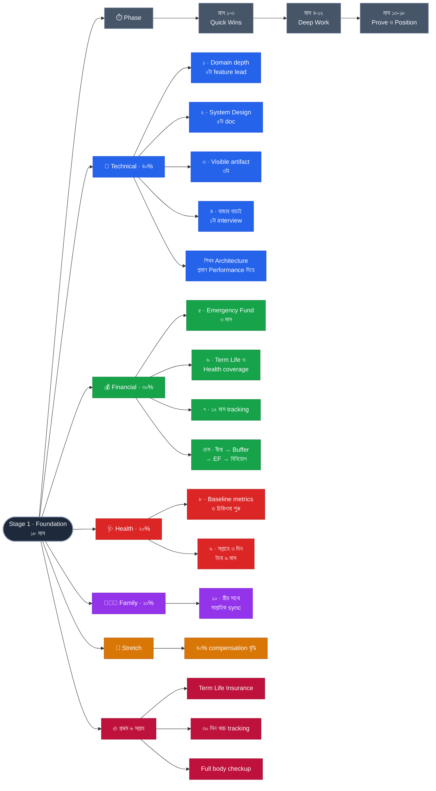

# Stage 1 — Foundation: Earn More, Waste Less

> 10-Stage Personal Life Roadmap · Stage 1 of 10
> সময়সীমা: **১৮ মাস** (২০২৬ সেপ্টেম্বর → ২০২৮ ফেব্রুয়ারি) · বয়স **৩২–৩৩** · শেষ হালনাগাদ: ২০২৬-০৯-০১
> **অবস্থা:** 🟢 বাস্তবায়নের জন্য প্রস্তুত · অনুমান → [ASSUMPTIONS.md](../ASSUMPTIONS.md)

---

## Baseline Snapshot (২০২৬-০৮)

| বিষয় | অবস্থা |
|---|---|
| নাম | Sojib Rd |
| বয়স | ৩২ |
| ধর্ম | হিন্দু |
| Sunnah / ইসলামিক অনুশীলন | নেই |
| বয়স | **৩২ বছর** |
| Experience | ৪ বছর, Software Engineer |
| ক্ষেত্র | **Frontend — Ember.js v6.4 (GJS)** |
| পরিবার | স্ত্রী + মেয়ে (১১ মাস), আলাদা সংসার; আরও ২ সন্তান পরিকল্পনা |
| Extended | মা, ভাই, ভাবি, ভাতিজি, ভাতিজা |
| সঞ্চয়ক্ষমতা | **২৫%+** মাসিক আয়ের |
| ঋণ | নেই |
| বিদ্যমান সঞ্চয় | নামমাত্র |
| Insurance | **কিছুই নেই** ⚠️ সবচেয়ে বড় ফাঁক |
| শেখার সময় | সপ্তাহে ৪–৭ ঘণ্টা (~৩৫০–৪৩০ ঘণ্টা / ১৮ মাস) |

---

## Pillar ওজন

| Pillar | ওজন | ভূমিকা |
|---|---|---|
| Technical Skills | **40%** | Primary — আয় বাড়ানোর প্রধান lever |
| Financial Management | **30%** | Secondary — কাঠামো তৈরি, বড় সঞ্চয় নয় |
| Health | **20%** | Minimum viable — অ-আলোচনাযোগ্য ন্যূনতম |
| Family Responsibility | **10%** | রুটিন-রক্ষা, নতুন উদ্যোগ নয় |

**যুক্তি:** ৪ বছর experience-এ সবচেয়ে বড় আর্থিক lever সঞ্চয় নয়, **আয়**। mid → senior জানালা এখন সবচেয়ে সস্তা; ৮–১০ বছরে সংকুচিত হয়ে যায়।

---

## Exit Criteria (Set B — Balanced) · ১০টা

### Technical
- [ ] **১.** একটা নির্দিষ্ট domain-এ depth — প্রমাণ: ২টা অ-তুচ্ছ feature design থেকে delivery পর্যন্ত একা নেতৃত্ব
- [ ] **২.** System Design-এ কার্যকরী দক্ষতা — প্রমাণ: ৫টা mock/real design সম্পূর্ণ ডকুমেন্টসহ
- [ ] **৩.** Visible artifact — লেখা / OSS contribution / tech talk (ন্যূনতম ৩টা)
- [ ] **৪.** বাজার যাচাই — Senior-level অন্তত ১টা interview process সম্পূর্ণ *(offer পাওয়া বাধ্যতামূলক নয়)*

### Financial
- [ ] **৫.** ৩ মাসের খরচের সমান Emergency Fund, আলাদা account-এ
- [ ] **৬.** Term Life Insurance + পরিবারের Health coverage সক্রিয়
- [ ] **৭.** ১২ মাস একটানা income-expense tracking; extended family-র মাসিক বরাদ্দ লিখিত

### Health
- [ ] **৮.** Baseline metrics নথিভুক্ত + অস্বাভাবিক কিছুর চিকিৎসা শুরু
- [ ] **৯.** সপ্তাহে ৩ দিন × ৩০ মিনিট শারীরিক কার্যকলাপ — টানা ৬ মাস

### Family
- [ ] **১০.** সাপ্তাহিক ৩০ মিনিট স্ত্রীর সাথে sync (পরিকল্পনা + সমস্যা), টানা চালু

### 🎯 Stretch Goal (exit criteria নয়)
- [ ] Senior title অথবা ন্যূনতম ৪০% compensation বৃদ্ধি
  *— নিজের সম্পূর্ণ নিয়ন্ত্রণে নয়, তাই criteria নয়। অর্জিত হলে বোনাস।*

---

## Phase কাঠামো (৩ / ৯ / ৬)

| Phase | সময় | মূল কাজ | শেখার ঘণ্টা |
|---|---|---|---|
| **১ · Quick Wins** | মাস ১–৩ | Insurance, checkup, budget চালু, learning path নির্বাচন | ~৬৫ |
| **২ · Deep Work** | মাস ৪–১২ | Architecture depth, feature ownership, EF জমা, exercise অভ্যাস | ~২০০ |
| **৩ · Prove & Position** | মাস ১৩–১৮ | Visible artifacts, Senior interview, Stage 2 পরিকল্পনা | ~১৩০ |

Phase 2 দীর্ঘ — ভেতরে **ত্রৈমাসিক checkpoint** রাখা বাধ্যতামূলক।

---

## Technical Focus

**শিখব: Architecture · প্রমাণ করব: Performance দিয়ে**

| বণ্টন | বিষয় | ঘণ্টা |
|---|---|---|
| **Frontend Architecture** | State ownership, component boundary, data flow, design system, বড় codebase scaling | ~২৪০ |
| **Performance** | শুধু ততটুকু যতটুকু একটা বাস্তব performance project করতে লাগে | ~৯০ |

**যুক্তি:** Senior হওয়া মানে framework-এ আরও দক্ষ হওয়া নয় — **সিদ্ধান্ত নেওয়ার ক্ষমতা**। ৪ বছরে কোড লিখতে জানেন; অনুপস্থিত হলো "কেন এভাবে, অন্যভাবে নয়" — এই যুক্তি। Architecture-এর দুর্বলতা প্রমাণে; Performance সেটা সংখ্যায় দেখায়। এক ঢিলে criteria ১, ৩ এবং brag document।

**বাদ দেওয়া হয়েছে:**
- Full-stack সম্প্রসারণ → ৩৫০ ঘণ্টায় ভাগ করলে দুই দিকেই mid-level। Stage 2-এর কাজ।
- AI-integrated engineering → মূল্যবান, কিন্তু architecture-এর *উপরে* বসে। Phase 3-এ ছোট artifact হিসেবে থাকবে।

---

## Protection Strategy

### Life Insurance — Pure Term + আলাদা বিনিয়োগ
- Coverage: **বার্ষিক আয়ের ~১৫ গুণ** — ⚠️ ৩ সন্তানের পরিকল্পনা ধরে। দুজন নির্ভরশীলের জন্য ১০–১২ গুণ যথেষ্ট, **চারজনের জন্য নয়**। এখন বেশি coverage কিনলে হারও এখনকার বয়সে লক হবে
- মেয়াদ: মেয়ে স্বাবলম্বী হওয়া পর্যন্ত (আনুমানিক নিজের বয়স ৫০–৫৫)
- **নিয়ম: বীমা আর বিনিয়োগ মেশাবেন না।** Endowment/সঞ্চয়ী plan একই coverage-এ ৫–৮ গুণ বেশি প্রিমিয়াম নেয় এবং রিটার্ন DPS-এর চেয়েও কম।
- এজেন্টকে স্পষ্ট বলুন: **"আমি শুধু Term plan চাই, সঞ্চয়ী নয়।"**
- একাধিক কোম্পানি থেকে quote নিন; **claim settlement ratio** জিজ্ঞেস করুন — প্রিমিয়ামের চেয়ে গুরুত্বপূর্ণ।
- ⏰ বয়সের সাথে premium দ্রুত বাড়ে এবং কেনার সময়ের হারই লক হয়। এক বছর দেরি = স্থায়ীভাবে বেশি।

### Health — Hybrid
- ছোট **Hospitalization policy** (বড় ঘটনার জন্য)
- **+ পৃথক Medical Buffer** (ছোট-মাঝারি খরচের জন্য) — Emergency Fund থেকে সম্পূর্ণ আলাদা
- **+ Employer-এর কাছে group coverage-এর প্রস্তাব** (খরচ শূন্য, চেষ্টাটুকুই যা লাগে)

**কেন পৃথক Buffer:** ১১ মাসের শিশু মানে অপ্রত্যাশিত চিকিৎসা খরচ এখন সবচেয়ে সম্ভাব্য। এক হাসপাতালের বিল পুরো Emergency Fund খেয়ে ফেলবে, আর আপনি টেরও পাবেন না সুরক্ষা চলে গেছে।

---

## সঞ্চয়ের বণ্টন (ক্রমানুসারে)

**হিসাব:** সঞ্চয়ক্ষমতা আয়ের ২৫%, তার ~১০% বীমা প্রিমিয়ামে → বরাদ্দযোগ্য **~২২.৫%**।
১৮ মাসে মোট জমা ≈ **৫.৪ মাসের খরচের সমান**। ৬ মাসের বিশুদ্ধ Emergency Fund সম্ভব নয় — এই ৫.৪ মাসকেই ভাগ করতে হবে।

| Phase | মাস | টাকা কোথায় | লক্ষ্য |
|---|---|---|---|
| **১** | ১–৩ | বীমা প্রিমিয়াম + **Medical Buffer** | ১ মাসের খরচের সমান Buffer |
| **২** | ৪–১২ | **Emergency Fund** (auto-transfer) | ~২.৭ মাস (মাস ১৩–১৪-এ ৩ মাস পূর্ণ) |
| **৩** | ১৩–১৮ | **বিনিয়োগ + মেয়ের education fund** | অভ্যাস ও শেখা চালু |

**নীতি: ক্রম গুরুত্বপূর্ণ, সমান্তরালতা নয়।** নিরাপত্তার স্তর নিচ থেকে উপরে — বীমা → Medical Buffer → Emergency Fund → বিনিয়োগ। নিচেরটা অসম্পূর্ণ রেখে উপরেরটা শুরু করলে প্রথম ধাক্কাতেই উপরেরটা ভাঙতে হয়।

- **Medical Buffer কেন আগে:** মেয়ের বয়স ১১ মাস — আগামী ১৮ মাসে সবচেয়ে সম্ভাব্য অপ্রত্যাশিত খরচ চাকরি হারানো নয়, **হাসপাতাল**।
- **বিনিয়োগ কেন Stage 1-এ, অল্প হলেও:** টাকার জন্য নয়, **শেখার জন্য**। Stage 2-এ আয় বাড়লে আপনি ইতিমধ্যেই জানবেন কোথায় কীভাবে রাখতে হয়। ছোট টাকায় ভুল করা সস্তা।

> ⚠️ সব সংখ্যা এখন অনুপাতে — **প্রকৃত মাসিক খরচ জানা নেই**। Phase 1-এর ৩০ দিনের tracking শেষ হলেই এগুলো টাকার অঙ্কে রূপ নেবে। তাই খরচ tracking শুধু একটা checklist item নয় — পুরো আর্থিক পরিকল্পনার ভিত্তি।

---

## 📋 Phase 1 — Quick Wins (মাস ১–৩)

> **সবচেয়ে জরুরি ৩টা:** Term Life Insurance · খরচ tracking শুরু · Full body checkup
> বাকি সব পিছিয়ে গেলেও এই তিনটা প্রথম ৬ সপ্তাহে।

### 🛡️ Protection (সপ্তাহ ১–৪)
- [ ] Employer-এর life/health coverage আছে কি না — HR থেকে লিখিত
- [ ] ৩টা কোম্পানি থেকে Term Life quote সংগ্রহ (coverage: **বার্ষিক আয়ের ~১৫ গুণ** — ৩ সন্তান ধরে)
- [ ] Term Life policy সক্রিয়
- [ ] পরিবারের Health coverage যাচাই/চালু (স্ত্রী + মেয়ে অন্তর্ভুক্ত নিশ্চিত)
- [ ] সব account, DPS, policy-তে nominee হালনাগাদ
- [ ] গুরুত্বপূর্ণ কাগজপত্র এক জায়গায় (ডিজিটাল কপিসহ) — স্ত্রী জানেন কোথায়

### 💰 Money System (সপ্তাহ ২–১২)
- [ ] ৩০ দিন কাঁচা খরচ tracking — কোনো বিচার নয়, শুধু রেকর্ড
- [ ] খরচকে category-তে ভাগ → প্রকৃত মাসিক খরচ বের করা
- [ ] Emergency Fund-এর জন্য আলাদা account (দৈনন্দিন account নয়)
- [ ] Salary আসার দিনেই auto-transfer — "যা বাঁচে তা সঞ্চয়" নয়
- [ ] মায়ের জন্য মাসিক নির্দিষ্ট বরাদ্দ লিখিত
- [ ] Extended family-র অনিয়মিত সাহায্যের বার্ষিক সীমা নির্ধারণ

### 🩺 Health Baseline (সপ্তাহ ৪–৮)
- [ ] Full body checkup — CBC, Blood Sugar/HbA1c, Lipid Profile, Vitamin D, TSH, Liver & Kidney, BP, ওজন
- [ ] অস্বাভাবিক কিছু থাকলে ডাক্তার ও চিকিৎসা শুরু
- [ ] স্ত্রীর checkup — postpartum পরবর্তী পরীক্ষা প্রায়ই বাদ পড়ে
- [ ] **পরবর্তী সন্তানের আগে স্ত্রীর প্রস্তুতি যাচাই** — সন্তান ২ পরিকল্পিত ~২০২৮, অর্থাৎ এই stage-এর শেষদিকে
- [ ] মেয়ের ১২ মাসের vaccination যাচাই ও সম্পন্ন
- [ ] ঘুমের ন্যূনতম সময় ও রাতের cut-off নির্ধারণ

### 💼 Career Baseline (সপ্তাহ ৬–১২)
- [ ] **Brag Document** শুরু — প্রতি সপ্তাহে ৫ মিনিট: কী delivered, কী impact, কী শিখলাম
- [ ] CV ও LinkedIn হালনাগাদ (পাঠানোর জন্য নয় — বর্তমান অবস্থান রেকর্ড করতে)
- [ ] দলে কোন কাজের ownership নিতে পারেন চিহ্নিত করে manager-এর সাথে কথা
- [ ] **Ember architecture learning path চূড়ান্ত** — state ownership · service boundary · component tree · Ember Data বনাম Service · GJS pattern

### 👨‍👩‍👧 Family Rhythm (সপ্তাহ ১ থেকে চলমান)
- [ ] স্ত্রীর সাথে সাপ্তাহিক ৩০ মিনিট sync — দিন ও সময় নির্দিষ্ট
- [ ] সপ্তাহে ২টা protected block (মোবাইল ছাড়া, শুধু মেয়ের সাথে) — ক্যালেন্ডারে

---

## 📋 Phase 2 — Deep Work (মাস ৪–১২)

> শেখার বাজেট: **~২০০ ঘণ্টা** (মাসে ~২২ ঘণ্টা, সপ্তাহে ~৫)
> এটাই Stage 1-এর হৃদয়। ত্রৈমাসিক checkpoint ছাড়া ৯ মাস ভেসে যাবে।

### 🔹 Q1 · মাস ৪–৬
- [ ] Architecture-এর ভিত্তি — একটা কাঠামোবদ্ধ উৎস (বই/কোর্স) সম্পূর্ণ: state ownership, data flow, component boundary
- [ ] নিজের codebase-এর একটা module-এর **architecture map** এঁকে ডকুমেন্ট করা (বর্তমান অবস্থা, সমস্যাসহ)
- [ ] **System Design doc #১** সম্পূর্ণ *(criteria ২-এর ১/৫)*
- [ ] **Feature Ownership #১ শুরু** — design doc লিখে, manager-এর সম্মতি নিয়ে
- [ ] EF auto-transfer চালু ও চলমান
- [ ] ব্যায়াম শুরু — ছোট থেকে, সপ্তাহে ৩ দিন × ৩০ মিনিট
- [ ] ✅ **Checkpoint (মাস ৬):** নিচের ৩ প্রশ্ন

### 🔹 Q2 · মাস ৭–৯
- [ ] **Feature #১ delivery সম্পূর্ণ** *(criteria ১-এর ১/২)*
- [ ] Design system-এর নীতি: reusable component-এর সীমানা, component API design
- [ ] **System Design doc #২ ও #৩** *(criteria ২-এর ৩/৫)*
- [ ] **Performance baseline পরিমাপ** — বর্তমান app-এর Core Web Vitals রেকর্ড করে রাখা
- [ ] ব্যায়াম টানা ৩ মাস পূর্ণ
- [ ] মেয়ের ১৮ মাসের vaccination
- [ ] ✅ **Checkpoint (মাস ৯)**

### 🔹 Q3 · মাস ১০–১২
- [ ] **Performance project** — baseline থেকে পরিমাপযোগ্য উন্নতি, আগে-পরের সংখ্যাসহ
- [ ] **Feature Ownership #২ শুরু**
- [ ] **System Design doc #৪** *(criteria ২-এর ৪/৫)*
- [ ] **প্রথম লেখা প্রকাশ** — performance project নিয়ে *(criteria ৩-এর ১/৩)*
- [ ] ব্যায়াম টানা ৬ মাস পূর্ণ → **criteria ৯ অর্জিত** ✅
- [ ] ১২ মাস একটানা tracking পূর্ণ → **criteria ৭ অর্জিত** ✅
- [ ] Follow-up medical test (যেগুলো baseline-এ অস্বাভাবিক ছিল)
- [ ] কর রেয়াতের কাগজপত্র গুছিয়ে রিটার্নে বিনিয়োগ দেখানো
- [ ] প্রথম বার্ষিক আর্থিক পর্যালোচনা
- [ ] ✅ **Checkpoint (মাস ১২)** — Phase 3-এ ঢোকার আগে

### চলমান (প্রতি সপ্তাহে/মাসে)
- [ ] Brag Document — সপ্তাহে ৫ মিনিট
- [ ] স্ত্রীর সাথে সাপ্তাহিক ৩০ মিনিট sync
- [ ] সপ্তাহে ২টা protected family block
- [ ] মায়ের সাথে নির্দিষ্ট যোগাযোগের ছন্দ
- [ ] ঘুমের cut-off বজায়

---

## 📋 Phase 3 — Prove & Position (মাস ১৩–১৮)

> শেখার বাজেট: **~১৩০ ঘণ্টা**
> এই phase-এ নতুন শেখা কম, **প্রমাণ ও অবস্থান তৈরি** বেশি। বেশিরভাগ engineer এই ধাপটাই বাদ দেয় — ফলে দক্ষতা বাড়লেও বাজারমূল্য বাড়ে না।

### 🔹 মাস ১৩–১৫
- [ ] **Feature #২ delivery সম্পূর্ণ** → **criteria ১ অর্জিত** ✅
- [ ] **System Design doc #৫** → **criteria ২ অর্জিত** ✅
- [ ] **Artifact #২** — internal tech talk বা OSS contribution
- [ ] **Artifact #৩** — দ্বিতীয় লেখা (architecture সিদ্ধান্ত নিয়ে) → **criteria ৩ অর্জিত** ✅
- [ ] Emergency Fund ৩ মাস পূর্ণ (মাস ১৩–১৪) → **criteria ৫ অর্জিত** ✅
- [ ] **CV ও LinkedIn Senior-level হিসেবে পুনর্লিখন** — brag document থেকে, দায়িত্ব নয় **প্রভাব** লিখে
- [ ] ~~React অনুবাদ~~ → **Stage 2-এ সরানো হয়েছে, ~১০০ ঘণ্টায়** — Ember বিশ্ববাজারে niche, তাই সংকেত পাঠাতে ৪০ ঘণ্টা যথেষ্ট নয়

### 🔹 মাস ১৬–১৮
- [ ] **Senior-level অন্তত ১টা interview process সম্পূর্ণ** → **criteria ৪ অর্জিত** ✅
- [ ] বর্তমান কোম্পানিতে promotion/compensation আলোচনা — brag document হাতে নিয়ে *(Stretch Goal)*
- [ ] **বিনিয়োগ চালু:** মেয়ের education DPS + সঞ্চয়পত্র + ছোট mutual fund
- [ ] Stage 1-এর **পূর্ণ পর্যালোচনা** — ১০টা criteria একে একে যাচাই
- [ ] **Stage 2-এর পরিকল্পনা** শুরু

---

## ✅ ত্রৈমাসিক Checkpoint — তিনটা প্রশ্ন

প্রতি checkpoint-এ ৩০ মিনিট, শুধু এই তিনটা:

1. **গত ত্রৈমাসিকে কোন criteria এগিয়েছে, কোনটা এক ইঞ্চিও নড়েনি?**
2. **যেটা নড়েনি — কারণ কি সময়ের অভাব, নাকি লক্ষ্যটাই ভুল ছিল?** *(এই পার্থক্যটাই আসল — সময়ের অভাব মানে পুনর্বণ্টন, ভুল লক্ষ্য মানে criteria বদলানো)*
3. **আগামী ত্রৈমাসিকে কোন একটা জিনিস বাদ দিলে বাকিগুলো ভালো হবে?**

---

## 💰 বিনিয়োগের Instrument (Phase 3-এ চালু)

| বাকেট | Instrument | কেন |
|---|---|---|
| **মেয়ের Education Fund** (~১৭ বছর) | দীর্ঘমেয়াদি **DPS** (১০ বছর), ছোট মাসিক অঙ্কে | ১৭ বছরের horizon-এ সবচেয়ে বড় নির্ধারক রিটার্ন নয়, **ধারাবাহিকতা**। DPS সেটা যন্ত্রে বেঁধে দেয়। |
| **General — মূল ~৮৫%** | **সঞ্চয়পত্র** (স্ত্রীর নামে পরিবার সঞ্চয়পত্র বিবেচনাযোগ্য) | নিশ্চিত রিটার্ন, শূন্য ঝুঁকি। সঞ্চয় এখনো নামমাত্র — ঝুঁকির চেয়ে ভিত্তি জরুরি। |
| **General — শেখার ~১৫%** | একটা **open-end Mutual Fund** | উদ্দেশ্য লাভ নয়, **অভিজ্ঞতা**। ছোট টাকায় ভুল করা সস্তা। |
| **এখন নয়** | সরাসরি শেয়ার, জমি, স্বর্ণ | সময়, দক্ষতা বা ticket size — কোনোটাই এখন মেলে না। |

**💡 কর রেয়াত:** Term Life প্রিমিয়াম, DPS, সঞ্চয়পত্র ও mutual fund — সবই বিনিয়োগ রেয়াতের জন্য গণ্য। অর্থাৎ বীমা শুধু সুরক্ষা নয়, করযোগ্য আয়ও কমায়।
⚠️ রেয়াতের হার, সীমা ও DPS-এ গণ্য বার্ষিক সর্বোচ্চ অঙ্ক **প্রতি বছর অর্থ আইনে বদলায়** — চলতি অর্থবছরের নিয়ম যাচাই করে নিন এবং সব রসিদ সংরক্ষণ করুন।

---

## ⏳ অমীমাংসিত

- [ ] প্রকৃত মাসিক খরচ (Phase 1-এর tracking শেষে) — এরপর সব আর্থিক লক্ষ্য টাকার অঙ্কে রূপ নেবে

---

## সিদ্ধান্তের লগ

| ধাপ | সিদ্ধান্ত |
|---|---|
| ১ | Framework: **Hybrid** (duration + exit criteria) |
| ২ | Theme: **Foundation — Earn More, Waste Less**, ১৮ মাস, Tech 40 / Fin 30 / Health 20 / Family 10 |
| ৩ | Exit Criteria: **Set B — Balanced** (১০টা) + comp বৃদ্ধি Stretch Goal হিসেবে |
| ৪ | Phasing: **৩ / ৯ / ৬** মাস, Phase 2-এ ত্রৈমাসিক checkpoint |
| ৫ | Baseline snapshot সংগৃহীত |
| ৬ | Protection: Life = **Pure Term + আলাদা বিনিয়োগ** · Health = **Hybrid (policy + buffer)** |
| ৭ | Technical: **Architecture (primary) + Performance (প্রমাণের বাহন)** |
| ৮ | সঞ্চয়ের বণ্টন: **ক্রমানুসারে** — Buffer → EF ৩ মাস → বিনিয়োগ। (৬ মাসের EF অসম্ভব বলে বাতিল) |
| ৯ | বিনিয়োগ: **DPS** (education fund) + **সঞ্চয়পত্র ৮৫%** + **mutual fund ১৫%** (শেখার জন্য) |
| ১০ | Phase 2 ও 3-এর checklist চূড়ান্ত · GitHub Issues tracking শুরু |

**Stage 1-এর পরিকল্পনা সম্পূর্ণ।** এরপরের কাজ পরিকল্পনা নয় — **বাস্তবায়ন**।

---

## Mindmap

