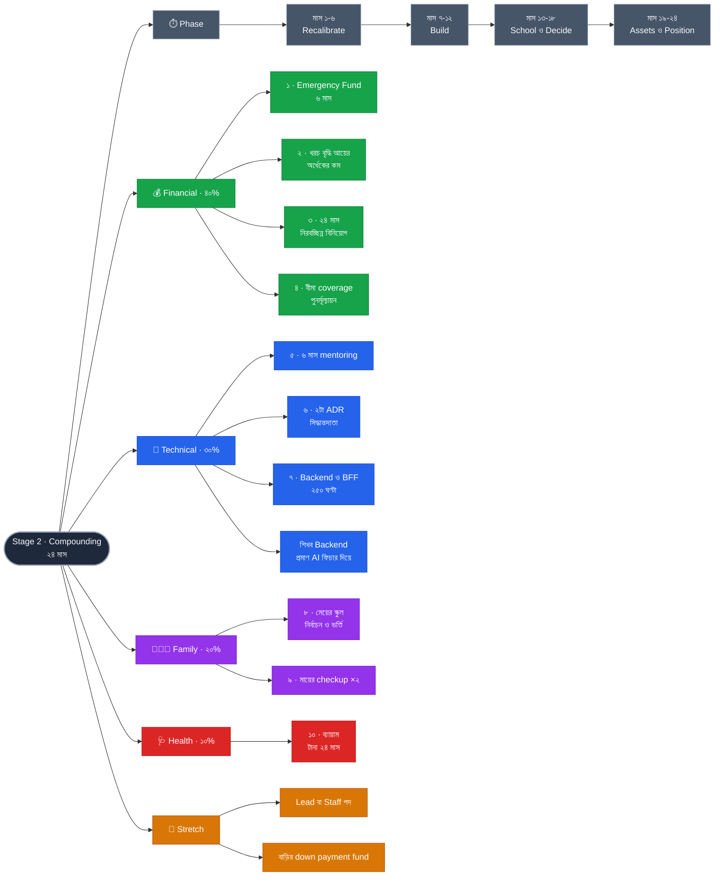

# Stage 2 — Compounding: Convert Skill into Assets

> 10-Stage Personal Life Roadmap · Stage 2 of 10
> সময়সীমা: **২৪ মাস** (~২০২৮ মার্চ → ২০৩০ ফেব্রুয়ারি) · শেষ হালনাগাদ: ২০২৬-০৯-০১
> **অবস্থা:** ভিত্তি চূড়ান্ত · পরিবর্তনশীল স্তর Stage 1-এর মাস ১৮-এ বসবে

---

## এই stage কেন

Stage 1-এর পুরো যুক্তি ছিল **আয় বাড়ানো**। Stage 2-এর কাজ সেই বৃদ্ধিকে **ধরে রাখা**।

ইঞ্জিনিয়ারদের ত্রিশের কোঠায় সবচেয়ে সাধারণ ব্যর্থতা: বেতন ৫০% বাড়ে, খরচও ৫০% বাড়ে, পাঁচ বছর পর সম্পদ প্রায় শূন্য। এই stage সরাসরি সেই ফাঁদের বিরুদ্ধে।

---

## প্রেক্ষাপট (Stage 2 শুরুর সময়)

| বিষয় | অবস্থা |
|---|---|
| মেয়ের বয়স | শুরুতে **~২.৫ বছর**, শেষে **~৪.৫ বছর** |
| প্রধান পারিবারিক ঘটনা | **স্কুলে ভর্তি** — এই stage-এর ভেতরেই |
| Stage 1 থেকে প্রাপ্ত | বীমা সক্রিয় · EF ৩ মাস · খরচের প্রকৃত হিসাব · architecture গভীরতা · বাজারে নিজের মূল্য জানা · বিনিয়োগের অভ্যাস |
| ⏳ অজানা | আয় কতটা বেড়েছে · Senior অবস্থান তৈরি হয়েছে কি না |

**পরিকল্পনার পদ্ধতি (Stage 2 · ধাপ ১):** **অপরিবর্তনীয় ভিত্তি + পরিবর্তনশীল স্তর।**
যা Stage 1-এর ফলাফল নির্বিশেষে একই — এখনই চূড়ান্ত। যা আয়ের উপর নির্ভরশীল (টাকার অঙ্ক) — মাস ১৮-এ বসবে।

---

## Pillar ওজন

| Pillar | ওজন | Stage 1-এ ছিল | পরিবর্তন |
|---|---|---|---|
| **Financial Management** | **40%** | 30% | ⬆️ Primary — আয়কে সম্পদে রূপান্তর |
| **Technical Skills** | **30%** | 40% | ⬇️ ধরন বদলেছে: পড়ে শেখা → কাজের ভেতরে শেখা |
| **Family Responsibility** | **20%** | 10% | ⬆️ স্কুল একটা প্রকৃত প্রকল্প |
| **Health** | **10%** | 20% | ⬇️ অভ্যাস তৈরি হয়ে গেছে, এখন শুধু রক্ষণাবেক্ষণ |

**Technical ৩০% মানে থেমে যাওয়া নয়, ধরন বদলানো।** Stage 1-এ ছিল ৩৫০ ঘণ্টা পড়ে শেখা। Stage 2-এ শেখা হবে কাজের ভেতরে — বড় দায়িত্ব, mentoring, architecture সিদ্ধান্ত। আলাদা ঘণ্টা কম লাগে, সাহস বেশি লাগে।

---

## Exit Criteria (Set B) · ১০টা

> নিয়ম: **binary · সর্বোচ্চ ১০টা · সবসময় নিজের নিয়ন্ত্রণে**

### 💰 Financial
- [ ] **১.** Emergency Fund **৬ মাসে** পূর্ণ
- [ ] **২.** **খরচ বৃদ্ধির হার আয় বৃদ্ধির হারের অর্ধেকের কম** — ২৪ মাসের tracking দিয়ে প্রমাণিত
      *(প্রত্যাশিত ফল: সঞ্চয়ের হার ২৫% → ~৩৫%)*
- [ ] **৩.** টানা ২৪ মাস নিরবচ্ছিন্ন মাসিক বিনিয়োগ + মেয়ের education fund
- [ ] **৪.** আয় বাড়ার পর **বীমা coverage পুনর্মূল্যায়ন ও সমন্বয়**

### 💼 Technical
- [ ] **৫.** অন্তত ১ জন junior-কে **টানা ৬+ মাস mentoring**
- [ ] **৬.** **২টা architecture decision doc (ADR/RFC)** যেখানে আপনিই সিদ্ধান্তদাতা, শুধু লেখক নন
- [ ] **৭.** **Backend/BFF কার্যকরী মাত্রায়** (~২৫০ ঘণ্টা) — প্রমাণ: একটা AI-চালিত ফিচার শুরু থেকে শেষ পর্যন্ত নিজে

### 👨‍👩‍👧 Family
- [ ] **৮.** মেয়ের **স্কুল নির্বাচন ও ভর্তি সম্পন্ন**; স্কুলের খরচ budget-এ স্থায়ীভাবে অন্তর্ভুক্ত
- [ ] **৯.** **মায়ের বার্ষিক checkup** দুই বছরেই সম্পন্ন

### 🩺 Health
- [ ] **১০.** ব্যায়াম অভ্যাস **টানা ২৪ মাস** + নিজের বার্ষিক checkup ×২

### 🎯 Stretch Goals (criteria নয়)
- [ ] **Lead / Staff Engineer** পদ অর্জিত — *জায়গা খালি থাকা আপনার হাতে নেই, তাই criteria নয়*
- [ ] **বাড়ির down payment fund চালু** — *শুধু EF ৬ মাস পূর্ণ হওয়ার পরে, আগে নয়*

### কেন এই criteria গুলো

- **#২ এই stage-এর হৃদয়।** "সঞ্চয়ের হার ৩৫% করব" আপনার নিয়ন্ত্রণে নয় (আয় কতটা বাড়বে জানা নেই), কিন্তু "খরচ বৃদ্ধি আয় বৃদ্ধির অর্ধেকের কম" সম্পূর্ণ নিয়ন্ত্রণে — এবং কার্যত একই ফল দেয়।
- **#৪ প্রায় সবাই ভুলে যায়।** আয় ৪০% বাড়লে পরিবারের ভবিষ্যৎ প্রয়োজনও ৪০% বাড়ে, কিন্তু বীমার coverage পুরনো অঙ্কেই পড়ে থাকে। আপনি ভাবেন সুরক্ষিত, বাস্তবে অনুপাত কমে গেছে।
- **#৫ Senior → Lead-এর একমাত্র প্রমাণযোগ্য সেতু** — এবং title-নির্ভর নয়, অনুমতি ছাড়াই শুরু করা যায়।
- **#৯ কেন যোগ হলো:** ২০২৮–৩০-এ মায়ের বয়স আরও বাড়বে। বয়স্ক অভিভাবকের স্বাস্থ্য সমস্যা সাধারণত জরুরি অবস্থায় ধরা পড়ে, যখন খরচ ও চাপ দুটোই সর্বোচ্চ। বার্ষিক checkup সবচেয়ে সস্তা প্রতিরোধ।
- **#১০ একটাই কেন:** Stage 1-এ অভ্যাস *তৈরি* করেছেন; Stage 2-এ কাজ শুধু **ধরে রাখা**। নতুন লক্ষ্য যোগ করলে বিদ্যমান অভ্যাসটাই ঝুঁকিতে পড়ে।

---

## Technical Focus

**শিখব: Backend/BFF · প্রমাণ করব: AI ফিচার দিয়ে** *(Stage 1-এর একই নকশা)*

| বণ্টন | বিষয় | ঘণ্টা |
|---|---|---|
| **Backend / BFF** | API design, ডেটা মডেলিং, একটা backend ভাষা, deployment, observability-র ভিত্তি | ~১৭০ |
| **AI-integrated ফিচার** | সেই backend দিয়ে বাস্তব ফিচার — streaming, tool calling, eval, খরচ নিয়ন্ত্রণ | ~৮০ |

**"কার্যকরী মাত্রা" মানে** বিশেষজ্ঞ নয় — নিজে ছোট একটা জিনিস শুরু থেকে শেষ পর্যন্ত design করে production-এ দিতে পারা।

**যুক্তি:**
1. **Lead হতে হলে end-to-end বোঝা লাগবেই।** backend-এর সীমাবদ্ধতা না বুঝে নেওয়া frontend সিদ্ধান্ত অর্ধেক সিদ্ধান্ত। Stretch Goal এখানেই দাঁড়ায় বা পড়ে।
2. **Stage 1-এ যে কারণে বাদ দিয়েছিলাম, সে কারণ আর নেই।** তখন ৩৫০ ঘণ্টা ভাগ করলে দুই দিকেই mid-level থেকে যেতেন। এখন backend যোগ হচ্ছে **গভীরতার উপরে প্রস্থ হিসেবে**, গভীরতার বদলে নয়। ক্রমটাই ছিল আসল।
3. **AI একা নিলে ফাঁপা থাকত।** বাস্তব AI ফিচারে backend লাগেই — key ব্যবস্থাপনা, streaming, ডেটা, খরচ, eval। Backend শিখলে AI নাগালে আসে; উল্টোটা হয় না।

**এখন নয়:** Engineering Management — এটা দিক বদলের সিদ্ধান্ত, দক্ষতা যোগ নয়। mentoring দিয়ে স্বাদ পাবেন; পুরো সিদ্ধান্ত Stage 3-এ।

---

## 📋 Phase 1 — Recalibrate & Ground (মাস ১–৬)

> ২০২৮ মার্চ–আগস্ট · Backend ~৬০ ঘণ্টা
> **এই phase-এর কাজ: নতুন বাস্তবতায় সব সংখ্যা বসানো।** Stage 1 শেষ, আয় বদলেছে — পুরনো হিসাব আর চলবে না।

- [ ] Stage 1-এর ফলাফল অনুযায়ী **পরিবর্তনশীল স্তরের সব সংখ্যা নির্ধারণ** (নিচে দেখুন)
- [ ] **বীমা coverage পুনর্মূল্যায়ন ও বৃদ্ধি** *(criteria ৪)*
- [ ] নতুন savings rate ঠিক করে **auto-transfer বাড়ানো** — আয় বাড়ার প্রথম মাসেই, পরে নয়
- [ ] **খরচ বৃদ্ধির সীমা লিখিতভাবে নির্ধারণ** *(criteria ২-এর ভিত্তি)*
- [ ] Backend ভিত্তি শুরু — একটা ভাষা, API design, ডেটা মডেলিং
- [ ] **Mentoring শুরু** — একজন junior চিহ্নিত, manager-এর সম্মতি নেওয়া
- [ ] **মায়ের checkup #১**
- [ ] **স্কুলের প্রাথমিক খোঁজ** — তালিকা, দূরত্ব, খরচ, ভর্তির সময়সূচি
- [ ] ✅ **Checkpoint (মাস ৬)**

---

## 📋 Phase 2 — Build (মাস ৭–১২)

> ২০২৮ সেপ্টেম্বর–২০২৯ ফেব্রুয়ারি · Backend ~৭০ ঘণ্টা

- [ ] **BFF বা ছোট service নিজে design করে production-এ**
- [ ] **ADR/RFC #১** — আপনি সিদ্ধান্তদাতা
- [ ] Mentoring টানা ৬ মাস পূর্ণ → **criteria ৫ অর্জিত** ✅
- [ ] EF ৬ মাসের পথে — মাঝপথ অতিক্রম
- [ ] বিনিয়োগ ও education fund-এর অঙ্ক বাড়ানো
- [ ] স্কুলের তালিকা সংক্ষিপ্ত করা + সরেজমিন ভিজিট
- [ ] নিজের বার্ষিক checkup #১
- [ ] কর রিটার্ন — বিনিয়োগ রেয়াত পূর্ণ ব্যবহার
- [ ] ✅ **Checkpoint (মাস ১২)**

---

## 📋 Phase 3 — School & Decide (মাস ১৩–১৮)

> ২০২৯ মার্চ–আগস্ট · AI ফিচার ~৮০ ঘণ্টা
> মেয়ের বয়স ~৩.৫–৪ — ভর্তির প্রকৃত সময়।

- [ ] **AI-চালিত ফিচার প্রকল্প** — streaming, tool calling, eval, খরচ নিয়ন্ত্রণ
- [ ] **ADR/RFC #২** → **criteria ৬ অর্জিত** ✅
- [ ] **স্কুল চূড়ান্ত ও ভর্তি সম্পন্ন** → **criteria ৮-এর প্রধান অংশ** ✅
- [ ] স্কুলের খরচ budget-এ **স্থায়ী খাত** হিসেবে যোগ — নতুন স্থায়ী খরচ, এককালীন নয়
- [ ] **মায়ের checkup #২** → **criteria ৯ অর্জিত** ✅
- [ ] Lead/Staff-এর জন্য অবস্থান — manager-এর সাথে career পথ নিয়ে স্পষ্ট আলোচনা *(Stretch)*
- [ ] ✅ **Checkpoint (মাস ১৮)**

---

## 📋 Phase 4 — Assets & Position (মাস ১৯–২৪)

> ২০২৯ সেপ্টেম্বর–২০৩০ ফেব্রুয়ারি

- [ ] **Emergency Fund ৬ মাস পূর্ণ** → **criteria ১ অর্জিত** ✅
- [ ] ২৪ মাসের খরচ-বনাম-আয় বিশ্লেষণ → **criteria ২ যাচাই** ✅
- [ ] বিনিয়োগ টানা ২৪ মাস → **criteria ৩ অর্জিত** ✅
- [ ] Backend + AI দক্ষতা কার্যকরী মাত্রায় প্রমাণিত → **criteria ৭ অর্জিত** ✅
- [ ] নিজের বার্ষিক checkup #২ + ব্যায়াম ২৪ মাস → **criteria ১০ অর্জিত** ✅
- [ ] *(Stretch)* বাড়ির down payment fund চালু — **শুধু EF ৬ মাস পূর্ণ হওয়ার পরে**
- [ ] **Stage 2-এর পূর্ণ পর্যালোচনা** — ১০টা criteria একে একে
- [ ] **Stage 3-এর পরিকল্পনা শুরু**

---

## চলমান (পুরো ২৪ মাস)

- [ ] Brag Document — সপ্তাহে ৫ মিনিট *(Stage 1 থেকে অব্যাহত)*
- [ ] স্ত্রীর সাথে সাপ্তাহিক ৩০ মিনিট sync
- [ ] সপ্তাহে ২টা protected family block
- [ ] ব্যায়াম সপ্তাহে ৩ দিন × ৩০ মিনিট
- [ ] মাসিক খরচ tracking
- [ ] extended family বরাদ্দ — বছরে একবার পুনর্মূল্যায়ন

---

## ✅ ছয়-মাসিক Checkpoint — তিনটা প্রশ্ন

1. গত ছয় মাসে কোন criteria এগিয়েছে, কোনটা এক ইঞ্চিও নড়েনি?
2. যেটা নড়েনি — কারণ সময়ের অভাব, নাকি লক্ষ্যটাই ভুল ছিল?
3. আগামী ছয় মাসে কোন একটা জিনিস বাদ দিলে বাকিগুলো ভালো হবে?

**Stage 2-এর জন্য বাড়তি প্রশ্ন:** *গত ছয় মাসে আয় কত বেড়েছে, আর খরচ কত? অনুপাতটা criteria #২ মানছে তো?*

---

## ⏳ পরিবর্তনশীল স্তর — Stage 1-এর মাস ১৮-এ বসবে

- [ ] বিনিয়োগের **মাসিক অঙ্ক**
- [ ] EF ৬ মাসের **প্রকৃত সংখ্যা**
- [ ] **স্কুলের বাজেট সীমা**
- [ ] বীমার **নতুন coverage**
- [ ] বাড়ির down payment fund — চালু করবেন কি না, কত

## ⏳ অমীমাংসিত

- [ ] **দ্বিতীয় সন্তানের পরিকল্পনা?** — পরিকল্পনার দিক থেকে Stage 2-এর সবচেয়ে বড় একক পরিবর্তক: খরচ, সঞ্চয়ের গতি, স্ত্রীর কর্মপরিকল্পনা, বাড়ির আকার। "হ্যাঁ" হলে Financial ওজন ৪০% যথেষ্ট নাও হতে পারে।
- [ ] দৈনন্দিন framework (Stage 1 থেকে চলমান)
- [ ] Shariah-সম্মত instrument দরকার কি না (Stage 1 থেকে চলমান)

---

## সিদ্ধান্তের লগ

| ধাপ | সিদ্ধান্ত |
|---|---|
| ১ | পরিকল্পনার পদ্ধতি: **অপরিবর্তনীয় ভিত্তি + পরিবর্তনশীল স্তর** |
| ২ | Theme: **Compounding — Convert Skill into Assets** · ২৪ মাস · Fin 40 / Tech 30 / Family 20 / Health 10 |
| ৩ | Exit Criteria: **Set B** (১০টা) + ২টা Stretch Goal |
| ৪ | সংলগ্ন দক্ষতা: **Backend/BFF শিখব, AI ফিচার দিয়ে প্রমাণ করব** |
| ৫ | Phasing: **৪ × ৬ মাস**, প্রতিটার আলাদা চরিত্র |

---

## Mindmap

