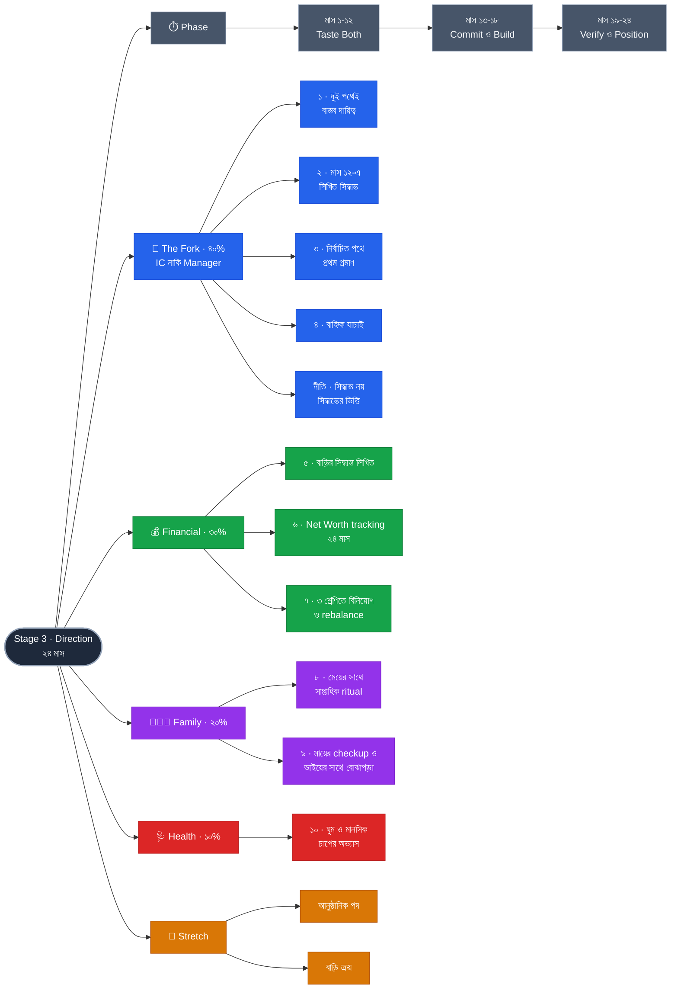

# Stage 3 — Direction: Choose the Track

> 10-Stage Personal Life Roadmap · Stage 3 of 10
> সময়সীমা: **২৪ মাস** (~২০৩০ মার্চ → ২০৩২ ফেব্রুয়ারি) · বয়স **৩৫–৩৭** · শেষ হালনাগাদ: ২০২৬-০৯-০১
> **অবস্থা:** ভিত্তি আঁকা · Stage 2-এর ফলাফলের পর পরিমার্জন হবে

---

## এই stage কেন

~৮ বছর experience-এ Individual Contributor আর Engineering Management — দুটো পথই খোলা থাকে। **~১২ বছরে গিয়ে সাধারণত আর থাকে না।** তখন আপনি সেই পথেই থাকেন যেটা আপনার প্রতিষ্ঠানের দরকার ছিল, যেটা আপনি বেছেছিলেন সেটা নয়।

**অসিদ্ধান্তও একটা সিদ্ধান্ত — শুধু সেটা অন্য কেউ নেয়।**

Stage 2 ইচ্ছাকৃতভাবে এই ফর্ক পিছিয়ে রেখেছিল, কিন্তু তথ্য জোগাড় করেছিল: mentoring (criteria ৫) ও architecture decision (criteria ৬) — এই দুটোই দুই পথের স্বাদ। Stage 3-এ সিদ্ধান্তটা তাই অনুমান নয়, **অভিজ্ঞতা** থেকে আসবে।

---

## প্রেক্ষাপট (Stage 3 শুরুর সময়)

| বিষয় | অবস্থা |
|---|---|
| সন্তানদের বয়স | **~৬.৪ · ~৩.৭ · সন্তান ৩ এই stage-এ জন্মাবে (~২০৩১)** |
| আপনার experience | **~৮ → ১০ বছর** · বয়স **৩৫–৩৭** |
| Stage 2 থেকে প্রাপ্ত | EF ৬ মাস · বিনিয়োগ চলমান · Backend+AI · mentoring অভিজ্ঞতা · স্কুল স্থিত |
| ⏳ অজানা | Lead/Staff হয়েছেন কি না · বাড়ির fund চালু কি না · দ্বিতীয় সন্তান |

> ⚠️ এই stage চার বছর দূরে। রূপরেখা ইচ্ছাকৃতভাবে পাতলা — কিছু criteria "অর্জন" নয়, **"সিদ্ধান্ত"** হিসেবে লেখা। Stage 2 শেষে পরিমার্জন হবে।

---

## Pillar ওজন

| Pillar | ওজন | Stage 2-এ ছিল |
|---|---|---|
| **Technical Skills** | **40%** | 30% ⬆️ |
| **Financial Management** | **30%** | 40% ⬇️ |
| **Family Responsibility** | **20%** | 20% → |
| **Health** | **10%** | 10% → |

Financial ৩০%-এ নামছে কারণ Stage 2-এ ভিত্তি (EF ৬ মাস, বিনিয়োগের অভ্যাস) তৈরি হয়ে গেছে — এখন সেটা চলতে থাকবে, নতুন করে গড়তে হবে না। Technical উঠছে কারণ **ফর্কের সিদ্ধান্ত এই stage-এর কেন্দ্র**।

---

## Exit Criteria (Set B) · ১০টা

> **নকশার নীতি:** সিদ্ধান্তকে criteria বানাবেন না — **সিদ্ধান্তের ভিত্তিকে** বানান।
> "IC নাকি Manager বেছে নেব" লিখলে মাস ২৩-এ বসে অনুমানে টিক পড়বে। তাই তিনটা আলাদা criteria: তথ্য সংগ্রহ → প্রতিশ্রুতি → বাস্তবায়ন।

### 💼 Technical — the Fork
- [ ] **১.** **দুই পথেই একটা করে বাস্তব দায়িত্ব** (formal title ছাড়াই):
      · *IC দিকে* — একটা cross-team বা system-level প্রকল্পে technical নেতৃত্ব
      · *Management দিকে* — একটা delivery-র পূর্ণ দায়িত্ব, বা ২+ জনের কাজ সমন্বয়
- [ ] **২.** **মাস ১২-এর মধ্যে লিখিত সিদ্ধান্ত** — ২ পাতার doc: কোন পথ · কেন · কোন প্রমাণের ভিত্তিতে · **কোন শর্তে পুনর্বিবেচনা করব**
- [ ] **৩.** **নির্বাচিত পথে প্রথম প্রকৃত প্রমাণ:**
      · *IC* — একাধিক টিম ব্যবহার করে এমন একটা system-level design + বাইরে দৃশ্যমানতা (talk/লেখা)
      · *Manager* — একটা টিম/pod-এর delivery দায়িত্ব টানা ৬ মাস + একজনের growth-এ পরিমাপযোগ্য অবদান
- [ ] **৪.** **বাহ্যিক যাচাই** — নির্বাচিত পথে অন্তত ১টা interview process সম্পূর্ণ *(offer বাধ্যতামূলক নয়)*

### 💰 Financial
- [ ] **৫.** **বাড়ির সিদ্ধান্ত লিখিতভাবে** — কিনব / কিনব না · কখন · কী শর্তে।
      কিনলে: down payment fund লক্ষ্যমাত্রায়। না কিনলে: সেই টাকা বিনিয়োগে।
      **"কিনব না"-ও বৈধ ফলাফল — লক্ষ্য বাড়ি নয়, সিদ্ধান্তহীনতার অবসান।**
- [ ] **৬.** **Net Worth tracking চালু ও টানা ২৪ মাস**
- [ ] **৭.** বিনিয়োগ **অন্তত ৩টা শ্রেণিতে বিভাজিত** + বছরে একবার পুনর্বিন্যাস (rebalance)

### 👨‍👩‍👧 Family
- [ ] **৮.** মেয়ের সাথে **একটা নিয়মিত "আমাদের জিনিস"** — সপ্তাহে নির্দিষ্ট একটা কার্যকলাপ, টানা ২৪ মাস
- [ ] **৯.** মায়ের বার্ষিক checkup ×২ **+ ভাইয়ের সাথে দীর্ঘমেয়াদি বোঝাপড়া লিখিত** — মায়ের ভবিষ্যৎ চিকিৎসা ও থাকার ব্যবস্থায় দায়িত্বের স্পষ্ট ভাগ

### 🩺 Health
- [ ] **১০.** ব্যায়াম অব্যাহত + বার্ষিক checkup ×২ + **ঘুম ও মানসিক চাপের একটা পরিমাপযোগ্য অভ্যাস**

### 🎯 Stretch Goals (criteria নয়)
- [ ] নির্বাচিত পথে **আনুষ্ঠানিক পদ** (Staff / Engineering Manager)
- [ ] **বাড়ি ক্রয় সম্পন্ন** *(সিদ্ধান্ত "কিনব" হলে)*

দুটোই আংশিকভাবে অন্যের সিদ্ধান্তের উপর নির্ভরশীল — পদ খালি থাকা, বাজারদর, ঋণ অনুমোদন। তাই criteria নয়।

### কেন এই criteria গুলো

- **#২-এর শেষ অংশটাই সবচেয়ে মূল্যবান — "কোন শর্তে পুনর্বিবেচনা করব"।** বেশিরভাগ মানুষ career সিদ্ধান্তকে স্থায়ী ভাবে, তাই ভুল হলেও আঁকড়ে থাকে। পুনর্বিবেচনার শর্ত আগে লিখে রাখলে সিদ্ধান্তটা আর পরিচয় থাকে না, **পরীক্ষা** হয়ে যায় — ভুল হলে ফিরে আসা লজ্জার বদলে পরিকল্পনার অংশ।
- **#৫:** বহু মানুষ বছরের পর বছর "একদিন কিনব" ভেবে টাকা নিষ্ক্রিয় রাখে, যা মূল্যস্ফীতিতে নিঃশব্দে ক্ষয় হয়। সিদ্ধান্ত যাই হোক, **টাকা যেন কাজে থাকে**।
- **#৬:** Stage 1–2-এ প্রশ্ন ছিল "টাকা কোথায় যাচ্ছে"। এখন প্রশ্ন বদলায় — **"সব মিলিয়ে আমি কি এগোচ্ছি?"** এই একটা সংখ্যাই পরবর্তী সব stage-এর মূল সূচক।
- **#৯-এর কঠিন অংশ:** মায়ের ভবিষ্যৎ দায়িত্ব নিয়ে ভাইয়ের সাথে আলোচনা অস্বস্তিকর, তাই সবাই এড়িয়ে যায় — এবং সংকটের মুহূর্তে, যখন সবাই ক্লান্ত ও আবেগপ্রবণ, তখন তা দ্বন্দ্বে রূপ নেয়। **শান্ত সময়ে ৩০ মিনিটের আলোচনা পরে বছরের পর বছর তিক্ততা বাঁচায়।**
- **#৮ নির্দিষ্ট কেন:** ৫–৭ বছর বয়সেই সন্তানের সাথে সম্পর্কের ধরন স্থির হয়। "সময় দেব" অস্পষ্ট; "প্রতি শুক্রবার সকালে আমরা দুজন X করি" — এটা মনে থাকে, মেয়ের স্মৃতিতেও থাকবে।

---

## 📋 Phase 1 — Taste Both (মাস ১–১২)

> **এই phase সুযোগ-নির্ভর, তাই দীর্ঘ ও নমনীয়।** কোন দায়িত্ব কখন আসবে আগে থেকে ঠিক করা যায় না — কিন্তু দুটোই নিতে হবে।

- [ ] **IC-দিকের দায়িত্ব** — একটা cross-team বা system-level প্রকল্প খুঁজে নেওয়া ও নেতৃত্ব দেওয়া
- [ ] **Management-দিকের দায়িত্ব** — একটা delivery-র পূর্ণ দায়িত্ব, বা ২+ জনের কাজ সমন্বয়
- [ ] প্রতিটার পরে **একটা সৎ নোট**: কী শক্তি দিয়েছে, কী ক্লান্ত করেছে, কোথায় সময় হারিয়েছে
- [ ] **দুই পথে থাকা ৪ জন সিনিয়রের সাথে কথা** (প্রতি পথে ২) — বিজ্ঞাপন নয়, প্রকৃত দৈনন্দিনটা জানা
- [ ] **Net Worth tracking চালু** *(criteria ৬)*
- [ ] মেয়ের সাথে সাপ্তাহিক **"আমাদের জিনিস" চালু** *(criteria ৮)*
- [ ] মায়ের checkup #১
- [ ] ✅ **Checkpoint (মাস ৬)** — দুটো দায়িত্বের অন্তত একটা শুরু হয়েছে তো?
- [ ] **মাস ১২: সিদ্ধান্ত doc লেখা** → **criteria ২ অর্জিত** ✅

---

## 📋 Phase 2 — Commit & Build (মাস ১৩–১৮)

- [ ] **সিদ্ধান্ত manager ও টিমকে জানানো** — অস্পষ্টতা না রাখা। ঘোষিত দিক না থাকলে সুযোগ আপনার কাছে আসে না
- [ ] নির্বাচিত পথে **প্রথম প্রমাণের কাজ শুরু** *(criteria ৩)*
- [ ] **ভাইয়ের সাথে মায়ের বিষয়ে আলোচনা** → লিখিত বোঝাপড়া *(criteria ৯)*
- [ ] বিনিয়োগ **৩ শ্রেণিতে বিভাজন** *(criteria ৭)*
- [ ] মায়ের checkup #২ + নিজের বার্ষিক checkup #১
- [ ] ✅ **Checkpoint (মাস ১৮)**

---

## 📋 Phase 3 — Verify & Position (মাস ১৯–২৪)

- [ ] **criteria ৩ সম্পূর্ণ** — প্রমাণ + দৃশ্যমানতা (IC) বা ৬ মাসের delivery দায়িত্ব (Manager) ✅
- [ ] **বাহ্যিক যাচাই** — নির্বাচিত পথে interview process সম্পূর্ণ → **criteria ৪** ✅
- [ ] **বাড়ির সিদ্ধান্ত লিখিত** → **criteria ৫** ✅
      *(ইচ্ছাকৃতভাবে career সিদ্ধান্তের পরে — ক্রম উল্টো হলে বাড়িই বিকল্প সীমিত করে দেয়)*
- [ ] বিনিয়োগ পুনর্বিন্যাস #১
- [ ] নিজের বার্ষিক checkup #২ → **criteria ১০** ✅
- [ ] Net Worth ২৪ মাস পূর্ণ → **criteria ৬** ✅
- [ ] **Stage 3-এর পূর্ণ পর্যালোচনা** → **Stage 4-এর পরিকল্পনা**

---

## চলমান (পুরো ২৪ মাস)

- [ ] Brag Document — সপ্তাহে ৫ মিনিট
- [ ] স্ত্রীর সাথে সাপ্তাহিক ৩০ মিনিট sync
- [ ] মেয়ের সাথে সাপ্তাহিক "আমাদের জিনিস"
- [ ] ব্যায়াম সপ্তাহে ৩ দিন × ৩০ মিনিট
- [ ] মাসিক খরচ ও net worth tracking
- [ ] বিনিয়োগ ও education fund — নিরবচ্ছিন্ন

---

## ✅ ছয়-মাসিক Checkpoint

1. কোন criteria এগিয়েছে, কোনটা এক ইঞ্চিও নড়েনি?
2. যেটা নড়েনি — সময়ের অভাব, নাকি লক্ষ্যটাই ভুল ছিল?
3. আগামী ছয় মাসে কোন একটা জিনিস বাদ দিলে বাকিগুলো ভালো হবে?

**Stage 3-এর বাড়তি প্রশ্ন:** *গত ছয় মাসে কোন কাজটা করার পর ক্লান্ত না হয়ে বরং শক্তি পেয়েছি?* — ফর্কের উত্তর এই প্রশ্নের ভেতরেই লুকিয়ে থাকে।

---

## ⏳ Stage 2 শেষে পরিমার্জন লাগবে

- [ ] Stage 2-এর Stretch Goal (Lead/Staff) অর্জিত হলে ফর্কের প্রশ্নটা ভিন্নভাবে দাঁড়াবে
- [ ] বাড়ির down payment fund চালু হয়েছে কি না — criteria #৫-এর প্রেক্ষাপট বদলাবে
- [ ] দ্বিতীয় সন্তান — উত্তর "হ্যাঁ" হলে Family ২০% এবং Financial ৩০% দুটোই পুনর্বিবেচনা
- [ ] সব টাকার অঙ্ক

---

## সিদ্ধান্তের লগ

| ধাপ | সিদ্ধান্ত |
|---|---|
| ১ | Theme: **Direction — Choose the Track** · ২৪ মাস · Tech 40 / Fin 30 / Family 20 / Health 10 |
| ২ | Exit Criteria: **Set B** (১০টা) + ২টা Stretch Goal · নীতি: **সিদ্ধান্ত নয়, সিদ্ধান্তের ভিত্তিকে criteria বানানো** |
| ৩ | Phasing: **১২ / ৬ / ৬** — অন্বেষণ নমনীয়, বাস্তবায়ন আঁটসাঁট |

---

## Mindmap

