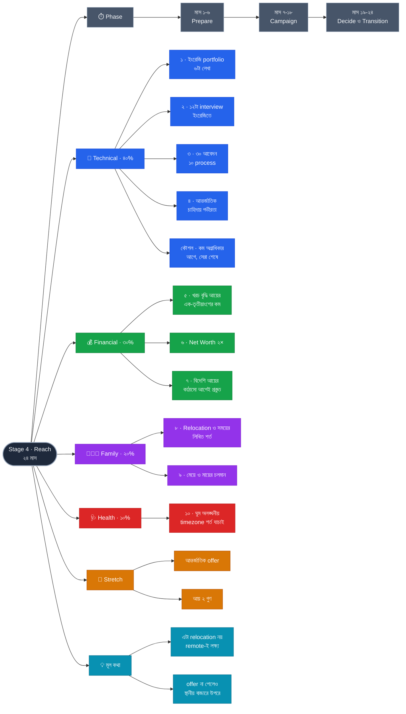

# Stage 4 — Reach: Beyond the Local Market

> 10-Stage Personal Life Roadmap · Stage 4 of 10
> সময়সীমা: **২৪ মাস** (~২০৩২ মার্চ → ২০৩৪ ফেব্রুয়ারি) · বয়স **৩৭–৩৯** · শেষ হালনাগাদ: ২০২৬-০৯-০১
> **অবস্থা:** কাঠামো আঁকা · Stage 3-এর ফলাফলের পর বড় পরিমার্জন লাগবে

---

## এই stage কেন

এই পর্যায়ে আপনার সঞ্চয়ের হার ~৩৫%। এই অবস্থায় **বিনিয়োগের রিটার্ন ২% বাড়ানোর চেয়ে আয় দ্বিগুণ করা বহুগুণ বেশি ফল দেয়।** অর্থাৎ ১০ বছর experience-এও প্রধান lever এখনো আয়ই — শুধু আয় বাড়ানোর উপায় বদলে যায়।

বাংলাদেশে অবস্থানরত ইঞ্জিনিয়ারের জন্য সেই উপায়টা **আন্তর্জাতিক বাজার** — পার্থক্যটা শতাংশে নয়, গুণিতকে।

**এবং পুরো roadmap নীরবে এদিকেই তৈরি হয়েছে:** Stage 1-এ visible artifact ও বাজার যাচাই, Stage 2-এ ADR ও end-to-end দক্ষতা, Stage 3-এ system-level design ও বাহ্যিক যাচাই — আন্তর্জাতিক নিয়োগে যা দেখা হয়, প্রায় হুবহু তাই।

> **এটা relocation-এর সমার্থক নয় — এবং সেটাই এর সবচেয়ে বড় সুবিধা।** মূল লক্ষ্য বিদেশি কোম্পানির জন্য **দেশে বসে remote কাজ**: পরিবারের উপড়ে যাওয়া নেই, মায়ের নৈকট্য অক্ষত, মেয়ের স্কুল অপরিবর্তিত। Relocation একটা আলাদা, ঐচ্ছিক সিদ্ধান্ত — এই stage সেটা দাবি করে না।

---

## প্রেক্ষাপট (Stage 4 শুরুর সময়)

| বিষয় | অবস্থা |
|---|---|
| বয়স / experience | **~৩৭–৩৯ / ১০–১২ বছর** |
| সন্তানদের বয়স | **~৮.৪ · ~৫.৭ · ~৩.০** — তিনজনই ছোট |
| Stage 3 থেকে প্রাপ্ত | career পথ নির্বাচিত ও ঘোষিত · বাড়ির সিদ্ধান্ত নেওয়া · net worth ট্র্যাকড · বিনিয়োগ বৈচিত্র্যময় |

> ⚠️ **বড় নির্ভরতা:** Stage 3-এ **Manager পথ** বেছে থাকলে এই stage-এর রূপ বদলাবে — cross-border remote ম্যানেজমেন্টের সুযোগ তুলনামূলক কম। সেক্ষেত্রে হয় regional/বড় প্রতিষ্ঠানের দিকে, নয় "দ্বিতীয় আয়ের উৎস" (Stage 2 ও 3-এ দুবার পিছিয়ে দেওয়া Option) — সেদিকে ঝুঁকতে হবে।

---

## Pillar ওজন

| Pillar | ওজন | Stage 3-এ ছিল |
|---|---|---|
| **Technical Skills** | **40%** | 40% → |
| **Financial Management** | **30%** | 30% → |
| **Family Responsibility** | **20%** | 20% → |
| **Health** | **10%** | 10% → |

ওজন অপরিবর্তিত, কিন্তু Technical-এর **বিষয়বস্তু** সম্পূর্ণ ভিন্ন — এবার দক্ষতা অর্জন নয়, **দক্ষতার বাজার বদলানো**।

---

## Exit Criteria (Set B) · ১০টা

> **নীতি:** আন্তর্জাতিক offer পাওয়া আপনার হাতে নেই — বাজার, timing, ভিসা, কোম্পানির বাজেট, সবই বাইরের। তাই criteria হবে **প্রস্তুতি ও প্রক্রিয়ার আয়তন**, ফলাফল নয়।
>
> এর একটা চমৎকার পার্শ্বফল: এই criteria পূরণ করলে offer না পেলেও **স্থানীয় বাজারে আপনি উপরের সারিতে চলে যাবেন**। ব্যর্থতার নিচের সীমাটাও লাভজনক।

### 💼 Technical
- [ ] **১.** **আন্তর্জাতিক মানের public portfolio** — নিজস্ব সাইট বা সমৃদ্ধ GitHub profile + **৬টা ইংরেজি লেখা/case study**, যেখানে আপনার architecture সিদ্ধান্ত ও যুক্তি পড়া যায়
- [ ] **২.** **ইংরেজিতে technical যোগাযোগে সাবলীলতা** — প্রমাণ: **১২টা mock/real technical interview ইংরেজিতে সম্পূর্ণ**, রেকর্ড করে নিজে পর্যালোচনা
- [ ] **৩.** **প্রক্রিয়ার আয়তন** — ২৪ মাসে **৩০টা লক্ষ্যভিত্তিক আবেদন** ও **১০টা interview process সম্পূর্ণ**
- [ ] **৪.** আন্তর্জাতিক বাজারের একটা **নির্দিষ্ট চাহিদায় গভীরতা** (~২৫০ ঘণ্টা) — নির্বাচিত career পথ অনুযায়ী

### 💰 Financial
- [ ] **৫.** **খরচ বৃদ্ধির হার আয় বৃদ্ধির এক-তৃতীয়াংশের কম** *(Stage 2-এ ছিল অর্ধেক — আয় গুণিতকে বাড়লে শৃঙ্খলা কড়া হতে হবে)*
- [ ] **৬.** **Net Worth = বার্ষিক খরচের ২ গুণ** ছোঁয়া, tracking টানা ২৪ মাস
- [ ] **৭.** **বিদেশি আয়ের কাঠামো আগেভাগে প্রস্তুত** — বৈধ remittance চ্যানেল, কর সম্মতি, চুক্তির ধরন (contractor বনাম employee), মুদ্রা-ঝুঁকি। **Offer আসার আগে, পরে নয়**

### 👨‍👩‍👧 Family
- [ ] **৮.** **স্ত্রীর সাথে লিখিত যৌথ অবস্থান** — দুই অংশে:
      · কোন শর্তে relocate করব, কোন শর্তে করব না
      · timezone overlap লাগলে **দিনের কোন সময়গুলো পরিবারের জন্য অলঙ্ঘনীয়**
- [ ] **৯.** মেয়ের সাথে সাপ্তাহিক "আমাদের জিনিস" অব্যাহত + মায়ের বার্ষিক checkup ×২

### 🩺 Health
- [ ] **১০.** ব্যায়াম অব্যাহত + বার্ষিক checkup ×২ + **ঘুমের সুরক্ষা** — timezone শিফট হলে ঘুমের সময় আলোচনার বিষয় নয়

### 🎯 Stretch Goals (criteria নয়)
- [ ] **আন্তর্জাতিক offer অর্জিত** (remote বা relocation)
- [ ] **আয় ২ গুণ বা তার বেশি**

### কেন এই criteria গুলো

- **#৩ এই stage-এর ইঞ্জিন।** আন্তর্জাতিক বাজারে সাফল্যের হার স্বাভাবিকভাবেই কম — ৩০টা আবেদনে ১০টা process, তাতে হয়তো ১–২টা offer। **এটা ব্যর্থতা নয়, এটাই স্বাভাবিক গণিত।** সংখ্যাটা আগে জানা থাকলে প্রত্যাখ্যান ব্যক্তিগত মনে হয় না, প্রক্রিয়ার অংশ মনে হয় — আর এই মানসিক পার্থক্যটাই বেশিরভাগ মানুষকে মাঝপথে থামিয়ে দেয়।
- **#২-এর "রেকর্ড করে পর্যালোচনা" ইচ্ছাকৃত।** বাংলাদেশি প্রকৌশলীদের সবচেয়ে সাধারণ প্রত্যাখ্যানের কারণ technical দুর্বলতা নয় — **নিজের কাজ ইংরেজিতে গুছিয়ে বলতে না পারা**। এটা ঠিক করা যায়, কিন্তু কেবল নিজেকে শুনে। অস্বস্তিকর, এবং সবচেয়ে ফলদায়ক।
- **#৭ কেন Financial-এ:** বিদেশি আয় মানে নতুন আইনি ও কর বাস্তবতা। **Offer পাওয়ার আগেই বোঝা দরকার**, কারণ চুক্তির শর্ত আলোচনার সময় এই জ্ঞানটাই আপনার সবচেয়ে বড় সুবিধা।
- **#৮ এই stage-এর সবচেয়ে গুরুত্বপূর্ণ পারিবারিক কাজ।** Offer হাতে আসার পর সাধারণত ৭–১৪ দিনে সিদ্ধান্ত দিতে হয় — সেই চাপের মুহূর্তে relocation নিয়ে **প্রথমবার** আলোচনা শুরু করা সবচেয়ে খারাপ সময়। শান্ত অবস্থায় শর্ত ঠিক করা থাকলে সিদ্ধান্তটা তখন কেবল একটা মিলিয়ে দেখা।
- **#১০-এ ঘুম আলাদা কেন:** আন্তর্জাতিক remote কাজের সবচেয়ে বাস্তব খরচ বেতন নয়, **ঘুম**। US timezone-এর সাথে কাজ করলে দীর্ঘমেয়াদে স্বাস্থ্য ও পারিবারিক উপস্থিতি দুটোই ক্ষয় হয়। তাই চাকরি খোঁজার সময়ই overlap-এর শর্ত যাচাই করা।

---

## 📋 Phase 1 — Prepare (মাস ১–৬)

> **লক্ষ্য: মাঠে নামার যোগ্য হওয়া — নিখুঁত হওয়া নয়।**

- [ ] Portfolio সাইট / GitHub profile দাঁড় করানো
- [ ] ইংরেজি লেখা #১–#৩ প্রকাশ *(Stage 1–3-এর কাজ থেকেই উপাদান নিন)*
- [ ] ইংরেজিতে mock interview শুরু — রেকর্ড করে নিজে শোনা
- [ ] **বিদেশি আয়ের কাঠামো গবেষণা** — remittance, কর, চুক্তির ধরন *(criteria ৭)*
- [ ] **স্ত্রীর সাথে relocation ও কাজের সময় নিয়ে আলোচনা → লিখিত অবস্থান** *(criteria ৮)*
- [ ] লক্ষ্য প্রতিষ্ঠানের তালিকা — **অগ্রাধিকার অনুযায়ী সাজানো**
- [ ] নির্দিষ্ট চাহিদায় গভীরতার কাজ শুরু *(criteria ৪)*
- [ ] ✅ **Checkpoint (মাস ৬)** — portfolio কি অপরিচিত কারো কাছে বোধগম্য?

---

## 📋 Phase 2 — Campaign (মাস ৭–১৮)

> **কৌশলগত নিয়ম — লক্ষ্যের ক্রম:** প্রথম আবেদনগুলো **কম অগ্রাধিকারের** প্রতিষ্ঠানে, সবচেয়ে কাঙ্ক্ষিতগুলো **শেষে**। আপনি প্রতিটা interview-তে ভালো হবেন, আর প্রত্যাখ্যানের পর পুনরায় আবেদনের দরজা ৬–১২ মাস বন্ধ থাকে। **সেরা সুযোগগুলো তখনই ব্যবহার করুন যখন আপনি সবচেয়ে ধারালো।**

- [ ] **৩০টা লক্ষ্যভিত্তিক আবেদন** — ক্রম অনুযায়ী *(criteria ৩)*
- [ ] **১০টা interview process সম্পূর্ণ**
- [ ] প্রতি process-এর পর **একটা নোট** — কী আটকেছে, পরেরবার কী বদলাব
- [ ] ইংরেজি লেখা #৪–#৬ প্রকাশ → **criteria ১ অর্জিত** ✅
- [ ] ১২টা interview পূর্ণ → **criteria ২ অর্জিত** ✅
- [ ] গভীরতার কাজ সম্পূর্ণ → **criteria ৪ অর্জিত** ✅
- [ ] মায়ের checkup ×২ + নিজের checkup #১
- [ ] ✅ **Checkpoint (মাস ১২)** — সাড়া না এলে: portfolio, লক্ষ্য নির্বাচন, নাকি উপস্থাপনা?
- [ ] ✅ **Checkpoint (মাস ১৮)**

---

## 📋 Phase 3 — Decide & Transition (মাস ১৯–২৪)

- [ ] Offer এলে — **আলোচনায় criteria #৭-এর জ্ঞান কাজে লাগানো**
- [ ] সিদ্ধান্ত **criteria #৮-এর লিখিত অবস্থানের সাথে মিলিয়ে** — নতুন করে আলোচনা নয়
- [ ] রূপান্তর: নতুন ভূমিকা শুরু, অথবা বর্তমান অবস্থান সংহত করা
- [ ] **Net Worth বার্ষিক খরচের ২ গুণ** → **criteria ৬** ✅
- [ ] ২৪ মাসের আয়-খরচ বিশ্লেষণ → **criteria ৫** ✅
- [ ] নিজের checkup #২ → **criteria ১০** ✅
- [ ] **Stage 4-এর পূর্ণ পর্যালোচনা → Stage 5-এর পরিকল্পনা**

**Offer না এলে কী?** — Phase 3 তবু বৃথা যায় না। আপনার হাতে থাকবে আন্তর্জাতিক মানের portfolio, ইংরেজিতে সাবলীলতা, ১০টা process-এর অভিজ্ঞতা এবং একটা স্পষ্ট নোট — কোথায় আটকেছে। **এটাই Stage 5-এর সবচেয়ে মূল্যবান ইনপুট।**

---

## চলমান (পুরো ২৪ মাস)

- [ ] Brag Document — সপ্তাহে ৫ মিনিট
- [ ] স্ত্রীর সাথে সাপ্তাহিক sync
- [ ] মেয়ের সাথে সাপ্তাহিক "আমাদের জিনিস"
- [ ] ব্যায়াম + ঘুমের সীমা রক্ষা
- [ ] Net Worth ও খরচ tracking
- [ ] বিনিয়োগ নিরবচ্ছিন্ন

---

## ✅ ছয়-মাসিক Checkpoint

1. কোন criteria এগিয়েছে, কোনটা এক ইঞ্চিও নড়েনি?
2. যেটা নড়েনি — সময়ের অভাব, নাকি লক্ষ্যটাই ভুল ছিল?
3. আগামী ছয় মাসে কোন একটা জিনিস বাদ দিলে বাকিগুলো ভালো হবে?

**Stage 4-এর বাড়তি প্রশ্ন:** *প্রত্যাখ্যানগুলো কি একই কারণে আসছে?* — একই কারণ বারবার এলে সেটা দুর্ভাগ্য নয়, সংশোধনযোগ্য একটা ফাঁক।

---

## ⏳ Stage 3 শেষে পরিমার্জন লাগবে

- [ ] **Manager পথ বেছে থাকলে** — পুরো stage-এর দিক বদলাবে (উপরে দেখুন)
- [ ] Stage 3-এ আন্তর্জাতিক সংস্পর্শ তৈরি হয়ে থাকলে Phase 1 ছোট হতে পারে
- [ ] দ্বিতীয় সন্তান — relocation সমীকরণ সম্পূর্ণ বদলে দেয়
- [ ] সব টাকার অঙ্ক ও net worth লক্ষ্যমাত্রা

---

## সিদ্ধান্তের লগ

| ধাপ | সিদ্ধান্ত |
|---|---|
| ১ | Theme: **Reach — Beyond the Local Market** · ২৪ মাস · Tech 40 / Fin 30 / Family 20 / Health 10 |
| ২ | Exit Criteria: **Set B** (১০টা) + ২টা Stretch Goal · নীতি: **প্রক্রিয়ার আয়তন criteria, ফলাফল Stretch** |
| ৩ | Phasing: **৬ / ১২ / ৬** + কৌশলগত নিয়ম: **কম অগ্রাধিকারের লক্ষ্য আগে, সেরাগুলো শেষে** |

---

## Mindmap

