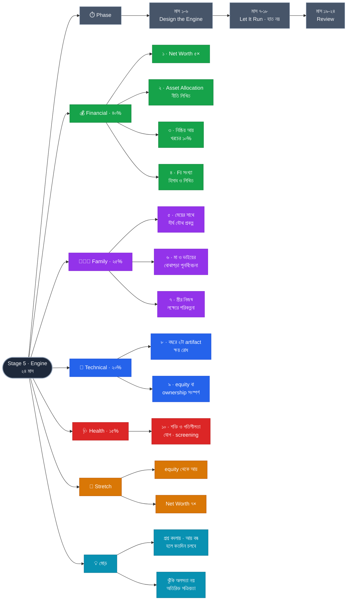

# Stage 5 — Engine: Make Money Work

> 10-Stage Personal Life Roadmap · Stage 5 of 10
> সময়সীমা: **২৪ মাস** (~২০৩৪ মার্চ → ২০৩৬ ফেব্রুয়ারি) · বয়স **৩৯–৪১** · শেষ হালনাগাদ: ২০২৬-০৯-০১
> **অবস্থা:** কাঠামো আঁকা · Stage 4-এর ফলাফলের পর পরিমার্জন

---

## এই stage কেন — roadmap-এর মোড়

**এই প্রথম Technical ২০%-এ নামছে।** Stage 1-এ ছিল ৪০%, কারণ তখন দক্ষতাই ছিল আয়ের একমাত্র lever। ১২–১৪ বছর experience-এ আরও শেখার প্রান্তিক ফল কমে আসে — **টাকা কোথায় বসছে, সেই প্রশ্নের ফল তখন অনেক বড়।** এটা অবনতি নয়, স্বাভাবিক স্থানান্তর।

প্রশ্নটাও বদলে গেছে:

| Stage 1–4 | Stage 5 |
|---|---|
| *আয় কীভাবে বাড়াব?* | *আয় বন্ধ হলে কতদিন চলবে?* |

উত্তরটা সঞ্চয়ের হারে নয়, **সম্পদের কাঠামোয়** — এবং ৩৯ বনাম ৪৫ বছরে শুরু করার পার্থক্য compounding-এ বিশাল।

---

## প্রেক্ষাপট (Stage 5 শুরুর সময়)

| বিষয় | অবস্থা |
|---|---|
| বয়স / experience | **~৩৯–৪১ / ১২–১৪ বছর** |
| সন্তানদের বয়স | **~১০.৪ · ~৭.৭ · ~৫.০** — বড়জন কৈশোরের ঠিক আগে |
| Stage 4 থেকে | সম্ভাব্য আন্তর্জাতিক আয় · Net Worth ≈ বার্ষিক খরচের ২× · portfolio ও ইংরেজি সাবলীলতা |

---

## Pillar ওজন

| Pillar | ওজন | Stage 4-এ ছিল | কেন |
|---|---|---|---|
| **Financial** | **40%** | 30% ⬆️ | প্রশ্ন বদলেছে — আয় নয়, সম্পদের কাঠামো |
| **Family** | **25%** | 20% ⬆️ | মেয়ের কৈশোর-পূর্ব **শেষ পূর্ণ stage** |
| **Technical** | **20%** | 40% ⬇️ | লক্ষ্য বৃদ্ধি নয়, **ক্ষয় রোধ** |
| **Health** | **15%** | 10% ⬆️ | ৩০-এর শেষভাগে অবহেলার সুদ চড়া |

**Family কেন বাড়ল:** মেয়ের বয়স Stage 5 শেষে ১০.৫ — Stage 6-এ কৈশোর। **যে নৈকট্য ৮–১১ বছরে সহজ, ১৩–১৬-তে সেটা আর সহজ নয়।** এই জানালা ফিরে আসে না, আর এটাই শেষ পূর্ণ stage যেটা পুরোটা এই জানালার ভেতরে।

---

## Exit Criteria (Set B) · ১০টা

### 💰 Financial
- [ ] **১.** **Net Worth = বার্ষিক খরচের ৫ গুণ** *(Stage 4 শেষে ছিল ২×)*
- [ ] **২.** **লিখিত Asset Allocation নীতি** — কোন শ্রেণিতে কত %, কেন, কখন বদলাবে + বছরে একবার rebalance
- [ ] **৩.** **শ্রম ছাড়া আসা প্রথম প্রকৃত নগদ প্রবাহ** — ভাড়া / লভ্যাংশ / মুনাফা যাই হোক, **মাসিক খরচের অন্তত ১০% ঢাকা**
- [ ] **৪.** **নিজের FI সংখ্যা হিসাব করা ও লিখে রাখা** — কত সম্পদ হলে কাজ ঐচ্ছিক হয়, বর্তমান হারে কত বছর লাগবে

### 👨‍👩‍👧 Family
- [ ] **৫.** মেয়ের সাথে **একটা দীর্ঘ যৌথ প্রকল্প বা ঐতিহ্য**, টানা ২৪ মাস *(সাপ্তাহিক ritual-এর পরের ধাপ)*
- [ ] **৬.** মায়ের বার্ষিক checkup ×২ + **Stage 3-এর ভাইয়ের সাথে বোঝাপড়া পুনর্বিবেচনা**
- [ ] **৭.** **স্ত্রীর নিজস্ব লক্ষ্য নিয়ে একটা যৌথ পরিকল্পনা** — পড়াশোনা, কাজ, বা উদ্যোগ

### 💼 Technical
- [ ] **৮.** **দৃশ্যমান অবস্থান বজায়** — বছরে ২টা artifact, মোট ৪
- [ ] **৯.** **একটা equity/ownership সংস্পর্শ** — equity-বহনকারী ভূমিকা, advisory, বা নিজের ছোট কিছু

### 🩺 Health
- [ ] **১০.** ব্যায়াম অব্যাহত + বার্ষিক checkup ×২ + **বয়স-উপযোগী screening শুরু** + **শক্তি ও গতিশীলতার কাজ যোগ** (শুধু cardio নয়) + দাঁত ও চোখ

### 🎯 Stretch Goals
- [ ] equity থেকে প্রকৃত আয়
- [ ] Net Worth **৭×**

### কেন এই criteria গুলো

- **#৪ এই stage-এর সবচেয়ে গুরুত্বপূর্ণ কাজ, অথচ সবচেয়ে কম করা হয়।** বেশিরভাগ মানুষ সারা জীবন "আরেকটু জমাই" ভেবে কাটিয়ে দেয়, কারণ **লক্ষ্যটা কখনো সংখ্যায় লেখেনি**। সংখ্যাটা জানা থাকলে দুটো জিনিস বদলায়: কত ঝুঁকি নেওয়া দরকার তা স্পষ্ট হয়, আর কখন থামা যায় তাও। এক সন্ধ্যার কাজ, কিন্তু পরবর্তী ২০ বছরের সব আর্থিক সিদ্ধান্তের কাঠামো।
- **#৩-এ ১০% কেন — অঙ্কটা ছোট, বিন্দুটা বড়।** ১০% নিষ্ক্রিয় আয় বাস্তব স্বাধীনতা দেয় না, কিন্তু প্রথমবার প্রমাণ করে **কাঠামোটা কাজ করে**। ১০% থেকে ১০০% যাওয়া সময় ও পরিমাণের প্রশ্ন; **০ থেকে ১০% যাওয়া একটা ধারণাগত লাফ।**
- **#৭ কেন:** বিয়ের পর থেকে স্ত্রীর নিজের লক্ষ্যগুলো সাধারণত পরিবারের প্রয়োজনের নিচে চাপা পড়ে। মেয়ের বয়স ~১০ — **এটাই প্রথম বাস্তব জানালা** যখন সেগুলো আবার সামনে আনা যায়। এটা উদারতা নয়: একজনের অপূর্ণতা দীর্ঘমেয়াদে গোটা পরিবারের উপর পড়ে।
- **#৮-এ "বছরে মাত্র ২টা" ইচ্ছাকৃত।** লক্ষ্য বৃদ্ধি নয়, **ক্ষয় রোধ**। বাজারমূল্য নিঃশব্দে কমে ঠিক তখনই, যখন আপনি স্বাচ্ছন্দ্যে থাকেন।
- **#১০-এ "শক্তি ও গতিশীলতা" আলাদা কেন:** Stage 1-এ ব্যায়াম শুরু হয়েছিল হৃদযন্ত্র ও ওজনের জন্য। ৩৬+ থেকে যা নীরবে ক্ষয় হয় তা **পেশি ও ভারসাম্য** — এবং তার প্রভাব ৬০ বছরে টের পাওয়া যায়, তখন আর ফেরানো যায় না।

---

## 📋 Phase 1 — Design the Engine (মাস ১–৬)

- [ ] **FI সংখ্যা হিসাব ও লিখিত** *(criteria ৪)*
- [ ] **Asset Allocation নীতি লেখা** — শতাংশ, যুক্তি, পুনর্বিন্যাসের শর্ত *(criteria ২)*
- [ ] **নগদ প্রবাহের উৎস নির্বাচন ও চালু** *(criteria ৩)*
- [ ] স্ত্রীর লক্ষ্য নিয়ে যৌথ পরিকল্পনা *(criteria ৭)*
- [ ] মেয়ের সাথে দীর্ঘ প্রকল্প/ঐতিহ্য শুরু *(criteria ৫)*
- [ ] বয়স-উপযোগী screening ও শক্তি-প্রশিক্ষণ যোগ *(criteria ১০)*
- [ ] ✅ **Checkpoint (মাস ৬)**

---

## 📋 Phase 2 — Let It Run (মাস ৭–১৮)

> **এই phase-এর প্রধান কাজ: হাত না দেওয়া।**
> এই stage-এর সবচেয়ে বড় ঝুঁকি অলসতা নয়, **অতিরিক্ত সক্রিয়তা**। বিনিয়োগে বেশিরভাগ ক্ষতি হয় বাজার পড়লে বিক্রি করে, বা "ভালো সুযোগ" দেখে সরিয়ে ফেলে। সিদ্ধান্তটা **এখনই** নেওয়া হয়ে থাকল — বাজার পড়ার দিন নয়।

- [ ] নিরবচ্ছিন্ন মাসিক বিনিয়োগ — নীতি অনুযায়ী, আবেগ অনুযায়ী নয়
- [ ] **বছরে একবার rebalance — এর বাইরে হাত নয়**
- [ ] Artifact #১–#২ প্রকাশ
- [ ] **equity/ownership সংস্পর্শ খোঁজা ও নেওয়া** *(criteria ৯)*
- [ ] মায়ের checkup ×২ + নিজের checkup #১ + ভাইয়ের সাথে পুনর্বিবেচনা *(criteria ৬)*
- [ ] ✅ **Checkpoint (মাস ১২ ও ১৮)**

---

## 📋 Phase 3 — Review & Reposition (মাস ১৯–২৪)

- [ ] **Net Worth ৫× যাচাই** → **criteria ১** ✅
- [ ] নগদ প্রবাহ খরচের ১০% ছুঁয়েছে? → **criteria ৩** ✅
- [ ] Artifact #৩–#৪ → **criteria ৮** ✅
- [ ] Allocation নীতি পুনর্মূল্যায়ন — দুই বছরে কী শিখলাম
- [ ] নিজের checkup #২ → **criteria ১০** ✅
- [ ] **Stage 5-এর পূর্ণ পর্যালোচনা → Stage 6-এর পরিকল্পনা**

---

## চলমান (পুরো ২৪ মাস)

- [ ] স্ত্রীর সাথে সাপ্তাহিক sync
- [ ] মেয়ের সাথে সাপ্তাহিক সময় + দীর্ঘ প্রকল্প
- [ ] ব্যায়াম (cardio + শক্তি + গতিশীলতা)
- [ ] Net Worth ও খরচ tracking
- [ ] বিনিয়োগ — নিরবচ্ছিন্ন, নীতি অনুযায়ী

---

## ✅ ছয়-মাসিক Checkpoint

1. কোন criteria এগিয়েছে, কোনটা নড়েনি?
2. যেটা নড়েনি — সময়ের অভাব, নাকি লক্ষ্যটাই ভুল?
3. আগামী ছয় মাসে কোন একটা জিনিস বাদ দিলে বাকিগুলো ভালো হবে?

**Stage 5-এর বাড়তি প্রশ্ন:** *গত ছয় মাসে বিনিয়োগে কি অপ্রয়োজনীয় হাত দিয়েছি?* — উত্তর "হ্যাঁ" হলে সেটাই এই stage-এর সবচেয়ে ব্যয়বহুল ভুল।

---

## ⏳ Stage 4 শেষে পরিমার্জন লাগবে

- [ ] আন্তর্জাতিক আয় এসেছে কি না — Net Worth ৫× লক্ষ্যমাত্রা পুরোপুরি এর উপর নির্ভরশীল
- [ ] Relocation হয়ে থাকলে সব আর্থিক instrument ও কর কাঠামো বদলাবে
- [ ] দ্বিতীয় সন্তান — Family ২৫% ও সব সংখ্যা পুনর্বিবেচনা
- [ ] সব টাকার অঙ্ক

---

## সিদ্ধান্তের লগ

| ধাপ | সিদ্ধান্ত |
|---|---|
| ১ | Theme: **Engine — Make Money Work** · ২৪ মাস · Fin 40 / Family 25 / Tech 20 / Health 15 |
| ২ | Exit Criteria: **Set B** (১০টা) + ২টা Stretch Goal |
| ৩ | Phasing: **৬ / ১২ / ৬** — Phase 2-এর কাজই **হাত না দেওয়া** |

---

## Mindmap

