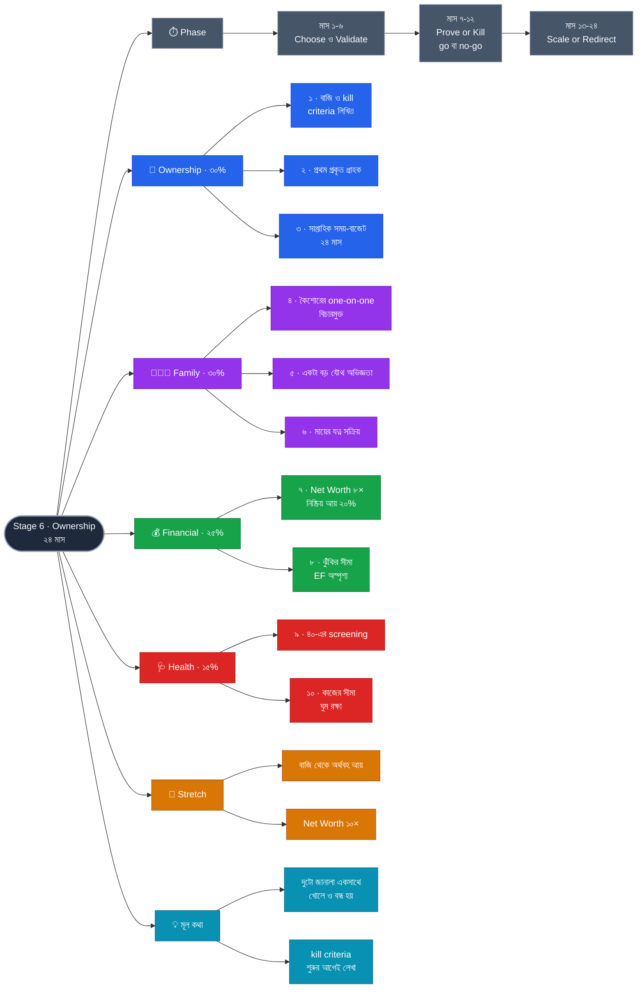

# Stage 6 — Ownership: Build Something of Your Own

> 10-Stage Personal Life Roadmap · Stage 6 of 10
> সময়সীমা: **২৪ মাস** (~২০৩৬ মার্চ → ২০৩৮ ফেব্রুয়ারি) · শেষ হালনাগাদ: ২০২৬-০৯-০১
> **অবস্থা:** কাঠামো আঁকা · Stage 5-এর ফলাফলের পর পরিমার্জন

---

## এই stage কেন — দুটো জানালা একসাথে

**এই প্রথম দুটো co-primary pillar (Technical 30 · Family 30)** — এবং সেটা ইচ্ছাকৃত, কারণ দুটো জানালা একই সময়ে খোলে ও বন্ধ হয়:

| জানালা | কেন এখন |
|---|---|
| **মালিকানা** | সম্পদ (Net Worth ৫×) এই প্রথম ঝুঁকি নেওয়ার সামর্থ্য দিচ্ছে, শক্তি এখনো আছে। **৪৫-এ দুটোর একটাও নিশ্চিত নয়।** |
| **কৈশোর** | ১৩–১৬ বছরে সম্পর্কের যে ভিত্তি তৈরি হয়, সারা জীবন সেটাই থাকে। এই stage তার ঠিক শুরুতে। |

**Financial ৪০ → ২৫% কেন:** Stage 5-এ engine তৈরি হয়ে গেছে; এখন সেটা নিজে চলবে। নতুন করে গড়ার কিছু নেই — শুধু নিরবচ্ছিন্নতা ও **সুরক্ষা**।

---

## প্রেক্ষাপট (Stage 6 শুরুর সময়)

| বিষয় | অবস্থা |
|---|---|
| বয়স / experience | **~৩৮–৪০ / ১৪–১৬ বছর** |
| মেয়ের বয়স | **~১০.৫ → ১২.৫** — কৈশোর শুরু |
| Stage 5 থেকে | Net Worth ৫× বার্ষিক খরচ · নিষ্ক্রিয় আয় খরচের ১০% · FI সংখ্যা জানা · asset allocation নীতি চালু |

---

## Pillar ওজন

| Pillar | ওজন | Stage 5-এ ছিল |
|---|---|---|
| **Technical (Ownership)** | **30%** | 20% ⬆️ |
| **Family** | **30%** | 25% ⬆️ |
| **Financial** | **25%** | 40% ⬇️ |
| **Health** | **15%** | 15% → |

---

## Exit Criteria (Set B) · ১০টা

### 💼 Ownership
- [ ] **১.** **বাজি বেছে নেওয়া ও লিখিত** — কোনটা · কেন · কত সময় ও টাকা · **কখন থামব (kill criteria)**
- [ ] **২.** **প্রথম প্রকৃত গ্রাহক বা ব্যবহারকারী** — টাকা দিয়েছে এমন অন্তত ১ জন, বা equity ভূমিকায় প্রকৃত প্রবেশ
- [ ] **৩.** **সপ্তাহে নির্দিষ্ট সময়-বাজেট, ২৪ মাস মেনে চলা** — বেশি নয়, কম নয়; ট্র্যাক করা

### 👨‍👩‍👧 Family
- [ ] **৪.** **কৈশোরের যোগাযোগ কাঠামো** — সাপ্তাহিক one-on-one, **বিচারমুক্ত**, টানা ২৪ মাস
- [ ] **৫.** মেয়ের সাথে **একটা বড় যৌথ অভিজ্ঞতা** — দীর্ঘ ভ্রমণ বা একসাথে একটা দক্ষতা অর্জন
- [ ] **৬.** **মায়ের যত্নের ব্যবস্থা সক্রিয়ভাবে চালু** — Stage 3-এর লিখিত বোঝাপড়ার বাস্তবায়ন

### 💰 Financial
- [ ] **৭.** **Net Worth = বার্ষিক খরচের ৮ গুণ** + নিষ্ক্রিয় আয় খরচের **২০%**
- [ ] **৮.** **ঝুঁকির সীমা লিখিত ও রক্ষিত** — মোট সম্পদের সর্বোচ্চ কত % বাজিতে যাবে; **EF ও education fund অস্পৃশ্য**

### 🩺 Health
- [ ] **৯.** ব্যায়াম + বার্ষিক checkup ×২ + **৪০-এর screening প্যাকেজ**
- [ ] **১০.** **কাজের সীমা** — বাজির কাজ ঘুম বা পারিবারিক সময় থেকে নেওয়া যাবে না; প্রমাণ: ২৪ মাসের ঘুমের গড়

### 🎯 Stretch Goals
- [ ] বাজি থেকে অর্থবহ আয়
- [ ] Net Worth **১০×**

### কেন এই criteria গুলো

- **#১-এর "kill criteria" সবচেয়ে গুরুত্বপূর্ণ।** কখন থামব সেটা **শুরুর আগে** লেখা — কারণ ব্যর্থ উদ্যোগে মানুষ টাকা নয়, **বছর** হারায়। শর্ত আগে লেখা থাকলে থামাটা পরাজয় নয়, পরিকল্পনার অংশ।
- **#৮ পুরো পরিবারের রক্ষাকবচ।** মালিকানার বাজি ব্যর্থ হতে পারে — সেটা ঠিক আছে। **কিন্তু সেটা যেন Stage 1–5-এ গড়া ভিত্তি ছুঁতে না পারে।** সীমা আগে লিখুন, উত্তেজনার মুহূর্তে নয়।
- **#৪-এ "বিচারমুক্ত" শব্দটা ইচ্ছাকৃত।** কৈশোরে সন্তান পরামর্শ চায় না, **শোনা** চায়। যে বাবা প্রতিবার সমাধান দেন, তাকে তৃতীয় বছরে আর কিছু বলা হয় না।
- **#১০ কেন criteria:** নিজের উদ্যোগের সবচেয়ে সাধারণ খরচ টাকা নয় — **ঘুম ও পরিবার**। সীমা না লিখলে বাজিটা নিঃশব্দে সবকিছু খেয়ে ফেলে।

---

## 📋 Phase 1 — Choose & Validate (মাস ১–৬)

- [ ] **বাজি নির্বাচন ও লিখিত** — kill criteria সহ *(criteria ১)*
- [ ] **ঝুঁকির সীমা লিখিত** — কত % সম্পদ, কোনটা অস্পৃশ্য *(criteria ৮)*
- [ ] সাপ্তাহিক সময়-বাজেট নির্ধারণ ও ট্র্যাকিং শুরু *(criteria ৩)*
- [ ] **প্রথম গ্রাহক/ব্যবহারকারী খোঁজা** — নির্মাণের আগে চাহিদা যাচাই
- [ ] কৈশোরের সাপ্তাহিক one-on-one চালু *(criteria ৪)*
- [ ] মায়ের যত্নের ব্যবস্থা সক্রিয় *(criteria ৬)*
- [ ] ৪০-এর screening প্যাকেজ *(criteria ৯)*
- [ ] ✅ **Checkpoint (মাস ৬)**

---

## 📋 Phase 2 — Prove or Kill (মাস ৭–১২)

- [ ] প্রথম প্রকৃত গ্রাহক/ব্যবহারকারী → **criteria ২** ✅
- [ ] বাজির চারপাশে ন্যূনতম কাঠামো তৈরি
- [ ] **মাস ১২: kill criteria যাচাই → go / no-go**
- [ ] ঘুম ও পারিবারিক সময়ের সীমা লঙ্ঘিত হয়েছে কি না — সৎ যাচাই *(criteria ১০)*
- [ ] ✅ **Checkpoint (মাস ১২) — এই stage-এর সবচেয়ে গুরুত্বপূর্ণ বিন্দু**

---

## 📋 Phase 3 — Scale or Redirect (মাস ১৩–২৪)

**Go হলে:**
- [ ] বাজি বাড়ানো — ঝুঁকির সীমার ভেতরে থেকে
- [ ] আয়ের পথ স্পষ্ট করা

**No-go হলে — stage ব্যর্থ নয়, পুনর্বিন্যাস:**
- [ ] কী শিখলাম, লিখিত — পরের বাজির জন্য
- [ ] সময় ও টাকা পুনঃবরাদ্দ: গভীরতা, নিষ্ক্রিয় আয়, বা পরিবার

**দুই ক্ষেত্রেই:**
- [ ] মেয়ের সাথে বড় যৌথ অভিজ্ঞতা → **criteria ৫** ✅
- [ ] Net Worth ৮× + নিষ্ক্রিয় আয় ২০% → **criteria ৭** ✅
- [ ] সময়-বাজেট ২৪ মাস পূর্ণ → **criteria ৩** ✅
- [ ] **Stage 6-এর পূর্ণ পর্যালোচনা → Stage 7-এর পরিকল্পনা**

---

## চলমান (পুরো ২৪ মাস)

- [ ] মেয়ের সাথে সাপ্তাহিক one-on-one — বিচারমুক্ত
- [ ] স্ত্রীর সাথে সাপ্তাহিক sync
- [ ] ব্যায়াম (cardio + শক্তি + গতিশীলতা)
- [ ] ঘুমের গড় ট্র্যাকিং
- [ ] বিনিয়োগ — Stage 5-এর নীতি অনুযায়ী, নিরবচ্ছিন্ন

---

## ✅ ছয়-মাসিক Checkpoint

1. কোন criteria এগিয়েছে, কোনটা নড়েনি?
2. যেটা নড়েনি — সময়ের অভাব, নাকি লক্ষ্যটাই ভুল?
3. আগামী ছয় মাসে কোন একটা জিনিস বাদ দিলে বাকিগুলো ভালো হবে?

**Stage 6-এর বাড়তি প্রশ্ন:** *বাজিটা কি ঘুম বা মেয়ের সময় থেকে চুরি করছে?* — উত্তর "হ্যাঁ" হলে বাজি নয়, **সীমা** ঠিক করুন।

---

## ⏳ Stage 5 শেষে পরিমার্জন লাগবে

- [ ] Net Worth ৫× অর্জিত হয়েছে কি না — না হলে এই stage-এ ঝুঁকি নেওয়ার ভিত্তি নেই, Stage 5 বাড়াতে হবে
- [ ] Stage 5-এর equity সংস্পর্শ (criteria ৯) কোন দিকে নিয়ে গেছে — বাজির রূপ সেটাই ঠিক করবে
- [ ] মেয়ের কৈশোরের বাস্তবতা — পরিকল্পনার চেয়ে বাস্তব সবসময় ভিন্ন
- [ ] সব টাকার অঙ্ক

---

## সিদ্ধান্তের লগ

| ধাপ | সিদ্ধান্ত |
|---|---|
| ১ | Theme: **Ownership — Build Something of Your Own** · ২৪ মাস · **Tech 30 / Family 30 (co-primary)** / Fin 25 / Health 15 |
| ২ | Exit Criteria: **Set B** (১০টা) + ২টা Stretch Goal |
| ৩ | Phasing: **৬ / ৬ / ১২** — **মাস ১২-এ কঠিন go/no-go**, তারপর Scale বা Redirect |

---

## Mindmap

