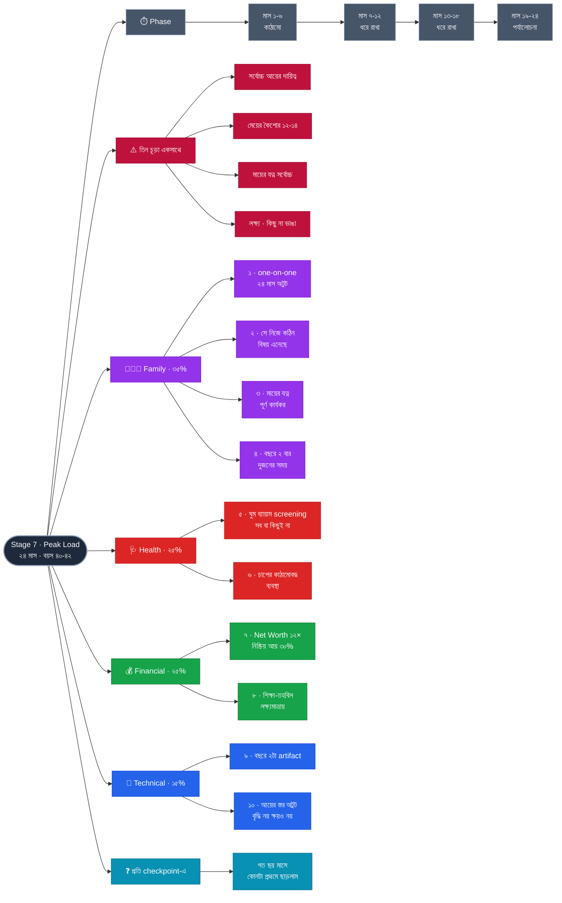

# Stage 7 — Peak Load: Hold Without Breaking

> 10-Stage Personal Life Roadmap · Stage 7 of 10
> সময়সীমা: **২৪ মাস** (~২০৩৮ মার্চ → ২০৪০ ফেব্রুয়ারি) · বয়স **~৪৩–৪৫** · শেষ হালনাগাদ: ২০২৬-০৯-০১
> **অবস্থা:** কাঠামো আঁকা · Stage 6 শেষে পরিমার্জন

---

## এই stage কেন — এটাই সবচেয়ে বিপজ্জনক জানালা

৪৩–৪৫ বছরে তিনটা দাবি একসাথে চূড়ায় ওঠে:

| দাবি | কী |
|---|---|
| **আয়** | পরিবারের সর্বোচ্চ আর্থিক দায়িত্ব আপনার কাঁধে |
| **সন্তান** | **তিনজন: ১৪.৪ · ১১.৭ · ৯.০** — বড়জনের কৈশোরের কঠিনতম বছর, বাকি দুজন স্কুলে |
| **অভিভাবক** | মায়ের যত্নের প্রয়োজন সম্ভবত এই জানালাতেই সর্বোচ্চ |

একে **sandwich generation** বলে — এবং এখানেই মানুষ সবচেয়ে বেশি ভেঙে পড়ে। স্বাস্থ্য ভাঙে, সম্পর্ক ক্ষয় হয়, অথবা কাজে ধস নামে।

> **তাই এই stage-এর লক্ষ্য অর্জন নয় — টিকে থাকা ও ভারসাম্য।**
> নতুন কোনো বড় বাজি নেই। Stage 6-এর মালিকানা চললে চলুক, না চললে থাক। এই দুই বছরে **কিছু না ভাঙাটাই সাফল্য।**

---

## Pillar ওজন

| Pillar | ওজন | Stage 6-এ ছিল | কেন |
|---|---|---|---|
| **Family** | **35%** | 30% ⬆️ | তিন প্রজন্মের দায়িত্ব একসাথে |
| **Health** | **25%** | 15% ⬆️ | এই stage-এ স্বাস্থ্য ভাঙাই সবচেয়ে বড় ঝুঁকি |
| **Financial** | **25%** | 25% → | engine চলছে, নতুন কিছু নয় |
| **Technical** | **15%** | 30% ⬇️ | শুধু প্রাসঙ্গিকতা ও আয়ের স্তর ধরে রাখা |

**Health ১৫ → ২৫% কেন:** আগের ছয় stage-এ স্বাস্থ্য ছিল অভ্যাস ও বিনিয়োগ। এখান থেকে এটা **প্রতিরক্ষা**। সর্বোচ্চ চাপের দুই বছরে শরীর ভাঙলে বাকি সব দাবি একসাথে অপূরণীয় হয়ে যায়।

---

## Exit Criteria · ১০টা

### 👨‍👩‍👧 Family
- [ ] **১.** মেয়ের সাথে **সাপ্তাহিক one-on-one অটুট, টানা ২৪ মাস** — কৈশোরের কঠিনতম বছরে চ্যানেল বন্ধ হতে না দেওয়া
- [ ] **২.** **অন্তত একটা কঠিন বিষয়ে খোলা কথোপকথন যা সে নিজে এনেছে** — এটাই একমাত্র প্রমাণ যে চ্যানেলটা সত্যিই কাজ করছে
- [ ] **৩.** **মায়ের যত্ন পূর্ণ কার্যকর** — নিয়মিত চিকিৎসা, প্রয়োজনীয় সহায়তা, ভাইয়ের সাথে দায়িত্বের কার্যকর ভাগ
- [ ] **৪.** স্ত্রীর সাথে সাপ্তাহিক sync + **বছরে অন্তত ২ বার দুজনের সময়, সন্তান ছাড়া**

### 🩺 Health
- [ ] **৫.** **ঘুম · ব্যায়াম · screening — তিনটাই ২৪ মাস অটুট।** একটাও ভাঙলে criteria ব্যর্থ *(ইচ্ছাকৃতভাবে কঠোর)*
- [ ] **৬.** **মানসিক চাপের একটা কাঠামোবদ্ধ ব্যবস্থা** — নিয়মিত বিরতি, নির্দিষ্ট অনুশীলন, বা পেশাদার সহায়তা

### 💰 Financial
- [ ] **৭.** **Net Worth = বার্ষিক খরচের ১২ গুণ** + নিষ্ক্রিয় আয় খরচের **৩০%**
- [ ] **৮.** **মেয়ের উচ্চশিক্ষার তহবিল লক্ষ্যমাত্রায়** *(খরচ শুরু Stage 9-এ)* + বীমা coverage পুনর্মূল্যায়ন

### 💼 Technical
- [ ] **৯.** দৃশ্যমান অবস্থান বজায় — বছরে ২টা artifact
- [ ] **১০.** **আয়ের স্তর অটুট** — বৃদ্ধি বাধ্যতামূলক নয়, **ক্ষয় নয়**

**🎯 Stretch:** Stage 6-এর বাজি থেকে অর্থবহ আয় · Net Worth ১৫×

### কেন এই criteria গুলো

- **#২ এই stage-এর সবচেয়ে চতুর criteria।** "সাপ্তাহিক কথা বলেছি" মাপা সহজ কিন্তু অর্থহীন — কৈশোরে সন্তান কথা বললেই খুলে বলে না। **সে নিজে একটা কঠিন বিষয় এনেছে** — এটাই একমাত্র প্রমাণ যে সে আপনাকে নিরাপদ মনে করে। না ঘটলে চ্যানেলটা মেরামত করতে হবে, বাড়াতে নয়।
- **#৫ ইচ্ছাকৃতভাবে "সব বা কিছুই না"।** সর্বোচ্চ চাপের সময় মানুষ প্রথমে ঘুম কাটে, তারপর ব্যায়াম, তারপর checkup পিছায়। একটা করে ছাড়লে টের পাওয়া যায় না। **তিনটা একসাথে বাঁধলে প্রথম ফাটলেই সংকেত আসে।**
- **#১০ কেন "বৃদ্ধি নয়, ক্ষয় নয়":** এই দুই বছরে career-এ আক্রমণাত্মক হওয়ার চেষ্টা করলে অন্য কিছু ভাঙবে। আবার ছেড়ে দিলে ফিরে আসা কঠিন। **স্থিতাবস্থাই এখানে সঠিক উচ্চাকাঙ্ক্ষা।**

---

## Phase কাঠামো — ৪ × ৬ মাস

সমান, পুনরাবৃত্ত, নতুন বাজিহীন। **এই stage-এ ঝুঁকি নাটকীয় ব্যর্থতা নয় — নীরব ক্ষয়।** তাই ঘন checkpoint, বড় phase নয়।

| Phase | মাস | নজর |
|---|---|---|
| ১ | ১–৬ | কাঠামো দাঁড় করানো: মায়ের যত্ন, চাপের ব্যবস্থা, স্বাস্থ্যের তিন স্তম্ভ |
| ২ | ৭–১২ | ধরে রাখা · প্রথম ফাটল খোঁজা |
| ৩ | ১৩–১৮ | ধরে রাখা · শিক্ষা-তহবিল লক্ষ্যমাত্রায় |
| ৪ | ১৯–২৪ | পর্যালোচনা → Stage 8 |

**প্রতি checkpoint-এ একটাই মূল প্রশ্ন:** *গত ছয় মাসে কোনটা প্রথমে ছাড়লাম?* — উত্তরটাই বলে দেবে কোথায় ভার বেশি।

---

## চলমান

মেয়ের সাথে one-on-one · স্ত্রীর সাথে sync · ব্যায়াম · ঘুম · বিনিয়োগ (নীতি অনুযায়ী) · Net Worth tracking

---

## ✅ ছয়-মাসিক Checkpoint

1. কোন criteria এগিয়েছে, কোনটা এক ইঞ্চিও নড়েনি?
2. যেটা নড়েনি — সময়ের অভাব, নাকি লক্ষ্যটাই ভুল ছিল?
3. আগামী ছয় মাসে কোন একটা জিনিস বাদ দিলে বাকিগুলো ভালো হবে?

**Stage 7-এর বাড়তি প্রশ্ন:** *গত ছয় মাসে কোনটা প্রথমে ছাড়লাম?* — উত্তরটাই বলে দেবে কোথায় ভার বেশি।

---

## সিদ্ধান্তের লগ

| | |
|---|---|
| Theme | **Peak Load — Hold Without Breaking** · ২৪ মাস |
| ওজন | Family 35 · Health 25 · Financial 25 · Technical 15 |
| Phasing | ৪ × ৬ — ঘন checkpoint, নতুন বাজি নেই |
| মূল নীতি | **এই দুই বছরে কিছু না ভাঙাটাই সাফল্য** |

---

## Mindmap

