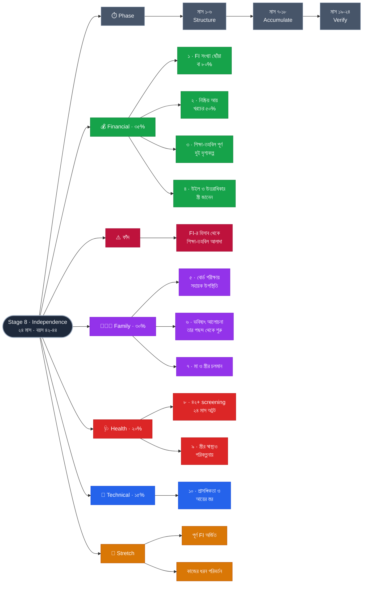

# Stage 8 — Independence: Work Becomes a Choice

> 10-Stage Personal Life Roadmap · Stage 8 of 10
> সময়সীমা: **২৪ মাস** (~২০৪০ মার্চ → ২০৪২ ফেব্রুয়ারি) · বয়স **~৪২–৪৪**

---

## এই stage কেন

Stage 5-এ আপনি **FI সংখ্যাটা লিখেছিলেন**। Stage 8-এ সেটা ছোঁয়ার কথা।

FI মানে চাকরি ছাড়া নয় — **কাজ বাধ্যবাধকতা থেকে পছন্দে রূপান্তরিত হওয়া।** এই পরিবর্তনটা মানসিক, আর্থিকের চেয়েও বেশি: যে কাজটা আপনি করতে *বাধ্য*, আর যেটা আপনি *বেছে নিয়েছেন* — একই কাজ হলেও দুটো ভিন্ন জীবন।

পারিবারিক দিকে মেয়ের বয়স ১৪.৪ → ১৬.৪ — **বোর্ড পরীক্ষা ও দিক নির্বাচনের বছর।** তার জীবনের প্রথম বড় চাপ, এবং প্রথমবার তার নিজের পছন্দ আপনার পছন্দ থেকে আলাদা হতে পারে।

> ⚠️ **একটা ফাঁদ এড়াতেই হবে:** FI সংখ্যার হিসাব থেকে **মেয়ের উচ্চশিক্ষার তহবিল সম্পূর্ণ আলাদা রাখুন।** ওই টাকা আপনার নয় — ওটা Stage 9-এ খরচ হয়ে যাবে। একসাথে গুনলে ভুল নিরাপত্তাবোধ তৈরি হবে, আর Stage 9-এ গিয়ে ধাক্কা লাগবে।

---

## Pillar ওজন

| Pillar | ওজন | Stage 7-এ ছিল |
|---|---|---|
| **Financial** | **35%** | 25% ⬆️ |
| **Family** | **30%** | 35% ⬇️ |
| **Health** | **20%** | 25% ⬇️ |
| **Technical** | **15%** | 15% → |

Stage 7-এর চাপের চূড়া পেরিয়ে এসেছেন; এখন আবার লক্ষ্যভিত্তিক কাজ সম্ভব।

---

## Exit Criteria · ১০টা

### 💰 Financial
- [ ] **১.** **FI সংখ্যা ছোঁয়া, অথবা তার ৮০%** — **মেয়ের শিক্ষা-তহবিল বাদ দিয়ে হিসাব**
- [ ] **২.** নিষ্ক্রিয় আয় **খরচের ৫০%** ঢাকছে
- [ ] **৩.** **মেয়ের উচ্চশিক্ষার তহবিল পূর্ণ** — **দেশে ও বিদেশে, দুটো দৃশ্যকল্পে আলাদা হিসাব**
- [ ] **৪.** **উত্তরাধিকার কাঠামো সম্পূর্ণ** — উইল, nominee, সম্পদের পূর্ণ তালিকা; **স্ত্রী সবকিছু জানেন এবং কোথায় আছে তা বলতে পারেন**

### 👨‍👩‍👧 Family
- [ ] **৫.** **বোর্ড পরীক্ষার বছরে সহায়ক উপস্থিতি** — চাপ না বাড়িয়ে। প্রমাণ: পরীক্ষার সময় সম্পর্ক খারাপ হয়নি
- [ ] **৬.** **মেয়ের ভবিষ্যৎ নিয়ে আলোচনা — তার পছন্দ থেকে শুরু, আপনার নয়**
- [ ] **৭.** মায়ের যত্ন অব্যাহত + স্ত্রীর সাথে সাপ্তাহিক sync ও বছরে ২ বার দুজনের সময়

### 🩺 Health
- [ ] **৮.** ঘুম · ব্যায়াম · **৪২+ screening প্যাকেজ** — ২৪ মাস অটুট
- [ ] **৯.** **স্ত্রীর স্বাস্থ্যও পরিকল্পনার অংশ** — বার্ষিক checkup, বয়স-উপযোগী screening। **যুগল হিসেবে স্বাস্থ্য, একা নয়**

### 💼 Technical
- [ ] **১০.** প্রাসঙ্গিকতা বজায় (বছরে ২টা artifact) + **আয়ের স্তর অটুট**

**🎯 Stretch:** পূর্ণ FI অর্জিত · কাজের ধরন পরিবর্তন (কম ঘণ্টা / ভিন্ন ভূমিকা)

### কেন এই criteria গুলো

- **#৪ সবচেয়ে অবহেলিত, অথচ সবচেয়ে জরুরি।** ৪২ বছরে উইল লেখা অস্বস্তিকর মনে হয়, কিন্তু আপনার সম্পদ এখন যথেষ্ট জটিল — একাধিক শ্রেণি, সম্ভবত বিদেশি আয়, বিনিয়োগ। **আপনার অনুপস্থিতিতে স্ত্রী যদি না জানেন কী কোথায়, তাহলে Stage 1-এর বীমা থেকে শুরু করে সব সুরক্ষা কাগজেই থেকে যাবে।**
- **#৬-এর "তার পছন্দ থেকে শুরু" ইচ্ছাকৃত।** ১৬ বছর বয়সে বাবার পেশা নিয়ে মতামত থাকা স্বাভাবিক, কিন্তু চাপিয়ে দিলে দুটো ক্ষতি: সে ভুল পথে যায়, আর আপনার সাথে সৎ কথা বলা বন্ধ করে। **আপনার কাজ দরজা দেখানো, ঠেলে দেওয়া নয়।**
- **#৯ কেন যোগ হলো:** এই বয়সে স্ত্রীর স্বাস্থ্যগত পরিবর্তনগুলো প্রায়ই অলক্ষিত ও অনালোচিত থেকে যায়। পুরো roadmap-এ আপনার স্বাস্থ্য নিয়মিত criteria — **তার স্বাস্থ্যও একই মর্যাদা পাওয়া উচিত।**
- **#১ কেন "৮০%-ও গ্রহণযোগ্য":** FI ছোঁয়া বাজারের উপরও নির্ভরশীল। ৮০% পৌঁছানো মানে সঞ্চয় ও কাঠামো ঠিক আছে — বাকিটা সময়ের প্রশ্ন। **নিয়ন্ত্রণের নিয়ম এখানেও প্রযোজ্য।**

---

## Phase কাঠামো — ৬ / ১২ / ৬

| Phase | মাস | কাজ |
|---|---|---|
| **১ · Structure** | ১–৬ | উত্তরাধিকার কাঠামো, শিক্ষা-তহবিলের দুই দৃশ্যকল্প, FI-র পুনঃহিসাব |
| **২ · Accumulate** | ৭–১৮ | নিরবচ্ছিন্ন — বোর্ড পরীক্ষার বছর, পরিবারে মনোযোগ |
| **৩ · Verify** | ১৯–২৪ | FI যাচাই, Stage 9-এর খরচের প্রস্তুতি |

---

## সিদ্ধান্তের লগ

| | |
|---|---|
| Theme | **Independence — Work Becomes a Choice** · ২৪ মাস |
| ওজন | Financial 35 · Family 30 · Health 20 · Technical 15 |
| Phasing | ৬ / ১২ / ৬ |
| মূল নীতি | **FI-র হিসাব থেকে শিক্ষা-তহবিল আলাদা — নইলে ভুল নিরাপত্তাবোধ** |

---

## Mindmap

