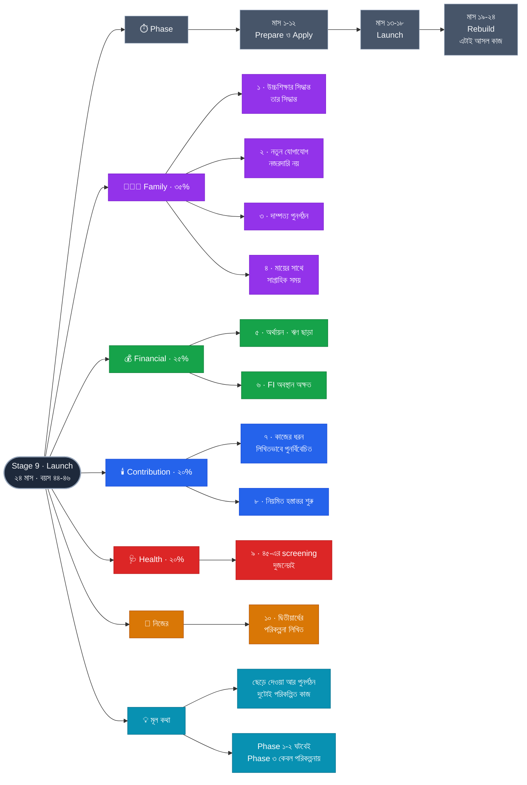

# Stage 9 — Launch: Let Go and Rebuild

> 10-Stage Personal Life Roadmap · Stage 9 of 10
> সময়সীমা: **২৪ মাস** (~২০৪২ মার্চ → ২০৪৪ ফেব্রুয়ারি) · বয়স **~৪৪–৪৬**

---

## এই stage কেন

মেয়ের বয়স ১৬.৪ → ১৮.৪। **উচ্চশিক্ষা, এবং সম্ভবত বাড়ি ছাড়া।**

এই stage-এ দুটো জিনিস একসাথে ঘটে, এবং দুটোই কঠিন:

| | |
|---|---|
| **ছেড়ে দেওয়া** | ১৮ বছর ধরে যে সন্তানকে গড়েছেন, তাকে নিজের সিদ্ধান্ত নিতে দেওয়া — এবং ভুল করতে দেওয়া |
| **পুনর্গঠন** | ১৮ বছর ধরে যে দাম্পত্য সন্তান-কেন্দ্রিক ছিল, সেটাকে আবার যুগল-কেন্দ্রিক করা |

দ্বিতীয়টা প্রায় কেউ পরিকল্পনা করে না — এবং সেজন্যই **সন্তান বাড়ি ছাড়ার পরের বছরগুলো অনেক দাম্পত্যে সবচেয়ে ফাঁকা সময়।** যে যুগল ১৮ বছর ধরে কেবল সহ-অভিভাবক ছিলেন, সন্তান চলে গেলে তাঁদের মধ্যে আর কী থাকে — সেই প্রশ্নের উত্তর আগে থেকে তৈরি না থাকলে ফাঁকটা টের পাওয়া যায়।

---

## Pillar ওজন

| Pillar | ওজন | Stage 8-এ ছিল |
|---|---|---|
| **Family** | **35%** | 30% ⬆️ |
| **Financial** | **25%** | 35% ⬇️ |
| **Health** | **20%** | 20% → |
| **Technical** | **20%** | 15% ⬆️ |

Technical সামান্য বাড়ছে — কিন্তু ধরন বদলে: **অর্জন নয়, হস্তান্তর।** Stage 10-এর প্রস্তুতি এখানেই শুরু।

---

## Exit Criteria · ১০টা

### 👨‍👩‍👧 Family
- [ ] **১.** **মেয়ের উচ্চশিক্ষার সিদ্ধান্ত ও ভর্তি সম্পন্ন** — **তার সিদ্ধান্ত, আপনার সমর্থন**
- [ ] **২.** **নতুন যোগাযোগের কাঠামো** — সে দূরে গেলে বা আধা-স্বাধীন হলে: নিয়মিত, কিন্তু নজরদারি নয়
- [ ] **৩.** **দাম্পত্য পুনর্গঠন** — একটা যৌথ পরিকল্পনা: সন্তান ছাড়া পরের ২০ বছর দুজনে কী করবেন
- [ ] **৪.** মায়ের যত্ন — বয়স তখন সবচেয়ে বেশি; **সপ্তাহে নির্দিষ্ট সময় তাঁর সাথে**

### 💰 Financial
- [ ] **৫.** **উচ্চশিক্ষার অর্থায়ন সম্পন্ন — ঋণ ছাড়া, FI তহবিল না ভেঙে**
- [ ] **৬.** শিক্ষা-খরচের পরও **FI অবস্থান অক্ষত** (বা ২ বছরের মধ্যে পুনরুদ্ধারযোগ্য)

### 💼 Technical → Contribution
- [ ] **৭.** **কাজের ধরন সচেতনভাবে পুনর্বিবেচিত ও লিখিত** — কম ঘণ্টা, ভিন্ন ভূমিকা, নাকি একই? **সিদ্ধান্তটা নেওয়া, ভেসে যাওয়া নয়**
- [ ] **৮.** **নিয়মিত হস্তান্তর শুরু** — mentoring, শেখানো, বা লেখা; মাসে অন্তত একবার

### 🩺 Health
- [ ] **৯.** ঘুম · ব্যায়াম · **৪৫-এর screening** — ২৪ মাস অটুট; স্ত্রীরও

### 🎯 নিজের
- [ ] **১০.** **দ্বিতীয়ার্ধের পরিকল্পনা লিখিত** — ৫০ থেকে ৭০, কী করতে চান। **Stage 10-এর কাঁচামাল**

**🎯 Stretch:** কাজ পূর্ণ ঐচ্ছিক · একটা দীর্ঘ যৌথ ভ্রমণ (স্ত্রীর সাথে)

### কেন এই criteria গুলো

- **#১-এর "তার সিদ্ধান্ত" অংশটা এই stage-এর সবচেয়ে কঠিন কাজ।** আপনি ততদিনে অভিজ্ঞ, আর্থিকভাবে সক্ষম, এবং সম্ভবত জানেন কোনটা ভালো হবে। **কিন্তু ১৮ বছরে নিজের সিদ্ধান্ত নিতে না শিখলে সে ২৮-এও শিখবে না।** আপনার কাজ তথ্য দেওয়া ও নিরাপত্তাজাল রাখা — সিদ্ধান্ত নেওয়া নয়।
- **#৩ পুরো roadmap-এর সবচেয়ে অবহেলিত ঝুঁকি।** সন্তান বাড়ি ছাড়ার পর অনেক দাম্পত্যে হঠাৎ করে বোঝা যায়, গত ১৮ বছরে কথোপকথনের প্রায় সবটাই সন্তানকে নিয়ে ছিল। **এই criteria সেই ফাঁকটা আগে থেকে ভরাট করার চেষ্টা।** Stage 5-এর criteria #৭ (স্ত্রীর নিজস্ব লক্ষ্য) ছিল এর প্রথম ধাপ।
- **#৫-এর "FI তহবিল না ভেঙে" কঠোরভাবে পালনীয়।** সন্তানের শিক্ষার জন্য অবসরের টাকা ভাঙা আবেগের দিক থেকে সহজ, কিন্তু ফলাফল নিষ্ঠুর: **সন্তান ঋণ নিয়ে পড়তে পারে, আপনি অবসরের টাকা ধার করতে পারবেন না।** Stage 7–8-এ তহবিল আলাদা রাখার পুরো কারণ এটাই।
- **#৭ কেন লিখিত:** ৪৫ বছরে বেশিরভাগ মানুষ কাজের ধরন বদলায় না — কারণ সিদ্ধান্ত নেয় না, কেবল চলতে থাকে। **FI-র পুরো মূল্য এখানেই: সিদ্ধান্তটা নেওয়ার সামর্থ্য।** না নিলে FI শুধু একটা সংখ্যা।

---

## Phase কাঠামো — ১২ / ৬ / ৬

| Phase | মাস | কাজ |
|---|---|---|
| **১ · Prepare & Apply** | ১–১২ | মেয়ের দিক নির্বাচন, আবেদন, ভর্তি · অর্থায়নের প্রস্তুতি |
| **২ · Launch** | ১৩–১৮ | সে রওনা দেয় · নতুন যোগাযোগের কাঠামো · প্রথম ধাক্কা |
| **৩ · Rebuild** | ১৯–২৪ | দাম্পত্য পুনর্গঠন · কাজের ধরনের সিদ্ধান্ত · দ্বিতীয়ার্ধের পরিকল্পনা |

**Phase 3-ই এই stage-এর আসল কাজ** — Phase 1 ও 2 ঘটবেই, পরিকল্পনা করুন বা না করুন। Phase 3 কেবল তখনই ঘটে যখন পরিকল্পনা করা হয়।

---

## সিদ্ধান্তের লগ

| | |
|---|---|
| Theme | **Launch — Let Go and Rebuild** · ২৪ মাস |
| ওজন | Family 35 · Financial 25 · Health 20 · Technical 20 |
| Phasing | ১২ / ৬ / ৬ |
| মূল নীতি | **ছেড়ে দেওয়া আর পুনর্গঠন — দুটোই পরিকল্পিত কাজ** |

---

## Mindmap

