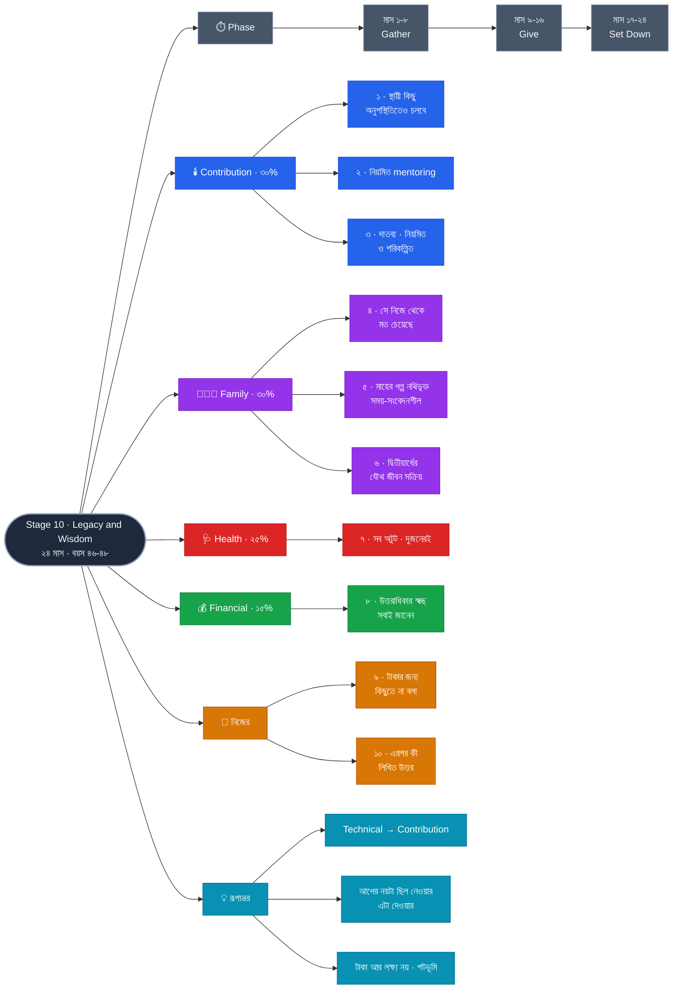

# Stage 10 — Legacy and Wisdom

> 10-Stage Personal Life Roadmap · Stage 10 of 10
> সময়সীমা: **২৪ মাস** (~২০৪৪ মার্চ → ২০৪৬ ফেব্রুয়ারি) · বয়স **~৪৬–৪৮**
> 🔒 **এই stage-টা প্রথম দিনেই চূড়ান্ত ছিল** — বাকি নয়টা এর দিকেই এগিয়েছে।

---

## এই stage কেন

আগের নয়টা stage ছিল **নেওয়ার** — দক্ষতা, আয়, সম্পদ, অবস্থান, স্বাধীনতা।

এটা **দেওয়ার**।

এবং এটা ত্যাগ নয়, ক্রম। আপনি দিতে পারছেন কারণ আগের নয় stage-এ যথেষ্ট নিয়েছেন — যথেষ্ট জানেন, যথেষ্ট আছে, এবং কাজ এখন পছন্দ। **উল্টো ক্রমে চেষ্টা করলে দেওয়াটা হয় না, শুধু ইচ্ছে থেকে যায়।**

---

## Pillar-এর রূপান্তর

এই stage-এ **Technical pillar-টা রূপ বদলায়** — এবং সেটাই এই roadmap-এর শেষ নকশাগত পদক্ষেপ:

| | Stage 1–9 | Stage 10 |
|---|---|---|
| **Technical** | দক্ষতা **অর্জন** | দক্ষতা **হস্তান্তর** |

| Pillar | ওজন |
|---|---|
| **Contribution** *(পূর্বে Technical)* | **30%** |
| **Family** | **30%** |
| **Health** | **25%** |
| **Financial** | **15%** |

**Financial ১৫% কেন — সর্বনিম্ন:** engine চলছে, FI অর্জিত, উত্তরাধিকার কাঠামো তৈরি। **এখানে টাকা আর লক্ষ্য নয়, পটভূমি।** এটাই ছিল প্রথম নয় stage-এর উদ্দেশ্য — টাকাকে এমন জায়গায় নিয়ে যাওয়া যেখানে সেটা আর ভাবতে হয় না।

**Health ২৫% কেন — দ্বিতীয় সর্বোচ্চ:** ৪৬–৪৮-এ যা রক্ষা করবেন, ৬৫-তে সেটাই থাকবে। এবং legacy রেখে যাওয়ার জন্য **সময় লাগে** — দীর্ঘায়ু নিজেই legacy-র একটা শর্ত।

---

## প্রেক্ষাপট

| | |
|---|---|
| মেয়ের বয়স | **~১৮.৪ → ২০.৪** — স্বাধীন প্রাপ্তবয়স্ক, সম্ভবত দূরে |
| মায়ের বয়স | অনেক বেশি — **প্রতিটা বছর গুরুত্বপূর্ণ** |
| আপনার অবস্থান | FI অর্জিত · কাজ ঐচ্ছিক · ২০+ বছরের অভিজ্ঞতা |

---

## Exit Criteria · ১০টা

### 🕯️ Contribution
- [ ] **১.** **একটা স্থায়ী কিছু রেখে যাওয়া** — বই, কোর্স, OSS প্রকল্প, বা প্রতিষ্ঠান। শর্ত একটাই: **আপনার অনুপস্থিতিতেও এটা কাজ করবে**
- [ ] **২.** **নিয়মিত mentoring** — একাধিক তরুণ প্রকৌশলী, টানা ২৪ মাস। শুধু পরামর্শ নয়, **দরজা খুলে দেওয়া**
- [ ] **৩.** **দাতব্য বা সামাজিক অবদান — নিয়মিত ও পরিকল্পিত**, উপলক্ষভিত্তিক নয়

### 👨‍👩‍👧 Family
- [ ] **৪.** **মেয়ের সাথে প্রাপ্তবয়স্ক সম্পর্কের ভিত্তি** — প্রমাণ: সে একটা গুরুত্বপূর্ণ সিদ্ধান্তে **নিজে থেকে** আপনার মত চেয়েছে
- [ ] **৫.** **পারিবারিক ইতিহাস ও মূল্যবোধ নথিভুক্ত** — **মায়ের কাছ থেকে শোনা গল্পসহ**, লেখা বা রেকর্ড করা
- [ ] **৬.** স্ত্রীর সাথে **দ্বিতীয়ার্ধের যৌথ জীবন সক্রিয়** — Stage 9-এর পরিকল্পনা বাস্তবে চলছে

### 🩺 Health
- [ ] **৭.** ঘুম · ব্যায়াম (শক্তি ও ভারসাম্য সহ) · সম্পূর্ণ screening — ২৪ মাস অটুট, দুজনেরই

### 💰 Financial
- [ ] **৮.** **আর্থিক উত্তরাধিকার সম্পূর্ণ ও স্বচ্ছ** — উইল হালনাগাদ, সব সম্পদ নথিভুক্ত, **পরিবারের সবাই জানেন**

### 🎯 নিজের
- [ ] **৯.** **অন্তত একবার এমন কিছুতে "না" বলেছেন যা কেবল টাকার জন্য** — এটাই FI-র একমাত্র বাস্তব পরীক্ষা
- [ ] **১০.** **"এরপর কী" — একটা লিখিত উত্তর।** Stage 10 শেষ, কিন্তু জীবন নয়

### কেন এই criteria গুলো

- **#৫ সবচেয়ে সময়-সংবেদনশীল।** আপনার মায়ের বয়স তখন অনেক। তাঁর জানা গল্প, পরিবারের ইতিহাস, যে সিদ্ধান্তগুলো আপনাদের আজকের অবস্থানে এনেছে — **এগুলো তাঁর সাথেই চলে যায়।** এটা এমন একটা criteria যা দেরি করলে আর পূরণ করা যায় না, যত টাকা বা সময়ই থাকুক। **সম্ভব হলে Stage 9-এই শুরু করুন।**
- **#৪-এর প্রমাণটা ইচ্ছাকৃতভাবে নিষ্ক্রিয়।** "মেয়ের সাথে ভালো সম্পর্ক" মাপা যায় না। **সে নিজে থেকে মত চেয়েছে** — এটা মাপা যায়, এবং এটাই একমাত্র সৎ সূচক। প্রাপ্তবয়স্ক সন্তান বাধ্য হয়ে কথা বলে না; সে আসে যদি আসার মতো কিছু থাকে।
- **#৯ পুরো roadmap-এর সমাপ্তি পরীক্ষা।** Stage 5-এ FI সংখ্যা লিখেছিলেন, Stage 8-এ ছুঁয়েছিলেন। কিন্তু FI কাগজে থাকে যতক্ষণ না আপনি সেটা **ব্যবহার** করেন। একটা লাভজনক কিন্তু অর্থহীন কাজে "না" বলা — এই একটা মুহূর্তে প্রমাণ হয় যে আগের নয় stage সত্যিই কাজ করেছে।
- **#১ কেন "আপনার অনুপস্থিতিতেও কাজ করবে":** যে অবদান আপনার উপস্থিতির উপর নির্ভরশীল, সেটা কাজ — legacy নয়। **পার্থক্যটা এই একটা শর্তেই।**
- **#১০ কেন আছে:** ১০টা stage-এর roadmap শেষ হলে একটা শূন্যতা তৈরি হয় — যেটা অবসরের সবচেয়ে সাধারণ সংকট। **শেষ criteria-টাই পরের অধ্যায়ের প্রথম পাতা।**

---

## Phase কাঠামো — ৮ / ৮ / ৮

তিনটা সমান পর্ব, তিনটা ভিন্ন দিক। এই stage-এ তাড়া নেই — তাই phase-গুলো লম্বা ও শান্ত।

| Phase | মাস | নজর |
|---|---|---|
| **১ · Gather** | ১–৮ | **মায়ের গল্প সংগ্রহ** · পারিবারিক ইতিহাস · উত্তরাধিকার নথি হালনাগাদ |
| **২ · Give** | ৯–১৬ | Mentoring কাঠামো · দাতব্য পরিকল্পনা · স্থায়ী কাজের নির্মাণ |
| **৩ · Set Down** | ১৭–২৪ | স্থায়ী কাজ সম্পূর্ণ · "এরপর কী" লেখা · পুরো ২০ বছরের পর্যালোচনা |

---

## শেষ কথা

এই roadmap শুরু হয়েছিল ২০২৬ সালে, একজন ৪ বছরের অভিজ্ঞতাসম্পন্ন ইঞ্জিনিয়ার আর ১১ মাসের একটা মেয়েকে নিয়ে। প্রথম stage-এর প্রথম কাজ ছিল একটা term life insurance কেনা — কারণ সেই মুহূর্তে সেটাই ছিল সবচেয়ে বড় খোলা ঝুঁকি।

কুড়ি বছর পরে সেই মেয়ে প্রাপ্তবয়স্ক, আর আপনি এমন একটা অবস্থানে যেখানে টাকা আর ভাবার বিষয় নয়।

**মাঝের ১২০টা মাস — সেগুলোই আসল roadmap।** এই ফাইলগুলো কেবল দিক দেখায়; হাঁটতে হয় প্রতিদিন, ছোট ছোট পদক্ষেপে, যার বেশিরভাগই সেই মুহূর্তে তুচ্ছ মনে হয়।

> **প্রতিটা stage-এর প্রথম সপ্তাহের কাজটাই সবচেয়ে গুরুত্বপূর্ণ। বাকিটা তার উপর দাঁড়ায়।**

---

## সিদ্ধান্তের লগ

| | |
|---|---|
| Theme | **Legacy and Wisdom** · ২৪ মাস · 🔒 প্রথম দিনেই চূড়ান্ত |
| ওজন | Contribution 30 · Family 30 · Health 25 · Financial 15 |
| Phasing | ৮ / ৮ / ৮ — Gather · Give · Set Down |
| রূপান্তর | **Technical pillar → Contribution** (অর্জন থেকে হস্তান্তরে) |
| মূল নীতি | **আগের নয়টা ছিল নেওয়ার। এটা দেওয়ার।** |

---

## Mindmap

